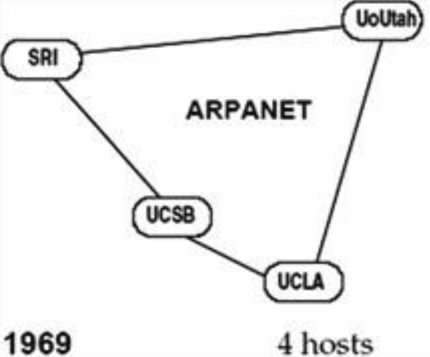
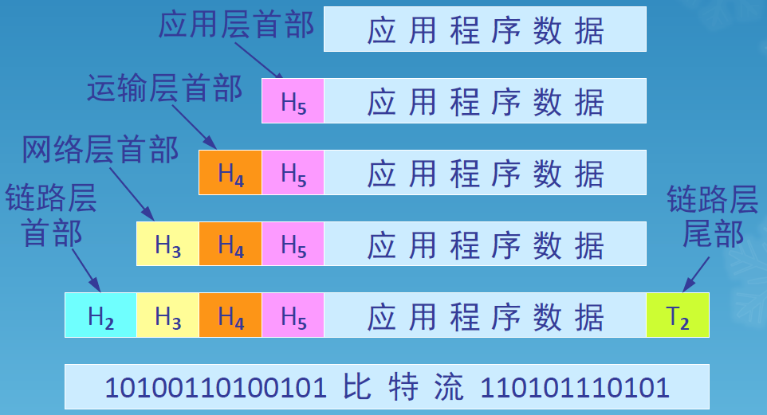
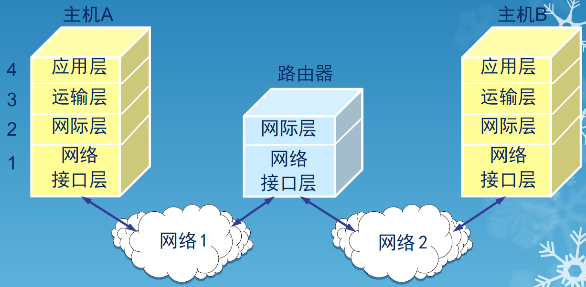

# WEEK 1

## 概述

### 网络

- 三种主要网络：电信网络(电话网)、有线电视网络、计算机网络
- 网络的诞生：1969年的ARPANET

### 计算机网络

- 点对点连接
- 总线网
- 星形网
- 环形网

### 计算机网络的功能

- 连通性
- 共享性：信息、软件、硬件

### 因特网

- 世界上最大的计算机网络
- 网络由若干结点和连接这些结点的链路组成
- 互联网是网络的网络，因特网是最大的互联网
- 主机是连接在因特网上的计算机
- 网络连接计算机，因特网连接网络

### 因特网发展的三个阶段

- 第一阶段是从单个网络ARPANET 向互联网发展的过程，1983 年TCP/IP 协议成为ARPANET 上的标准协议，因特网诞生
- 第二阶段的特点是建成了三级结构的因特网，即主干网、地区网和校园网(或企业网)
- 第三阶段的特点是逐渐形成了多层次ISP结构的因特网
  - 因特网服务提供者ISP(Internet Service Provider)
  - 因特网交换点IXP(Internet eXchange Point)
  - 根据提供服务的覆盖面积大小以及所拥有的IP地址数目的不同，ISP也分成为不同的层次
  - 主机A->本地ISP->第二层ISP->NAP->第一层ISP->NAP->第二层ISP->本地ISP->主机B

### 万维网

- World Wide Web
- 被广泛使用于因特网上，方便了广大非网络专业人员对网络的使用，成为因特网的这种指数级增长的主要驱动力

---

## 因特网的组成

### 边缘部分

- 由所有连接在因特网上的主机组成。这部分是用户直接使用的，用来进行通信（传送数据、音频或视频）和资源共享
- 处在因特网边缘的部分就是连接在因特网上的所有的主机，又称为端系统(end system)

#### 端系统程序间通信方式

##### 客户服务器方式

- C/S方式，即Client/Server方式
- 客户(client)和服务器(server)都是指通信中所涉及的两个应用进程
- 客户服务器方式所描述的是进程之间服务和被服务的关系
- 客户是服务的请求方，服务器是服务的提供方
- 客户软件被用户调用后运行，在打算通信时主动向远地服务器发起通信(请求服务)，必须知道服务器程序的地址，不需要特殊的硬件和很复杂的操作系统
- 服务器软件是一种专门用来提供某种服务的程序，可同时处理多个远地或本地客户的请求。系统启动后即自动调用并一直不断地运行着，被动地等待并接受来自各地的客户的通信请求，不需要知道客户程序的地址，一般需要强大的硬件和高级的操作系统支持

##### 对等连接方式

- P2P方式，即Peer-to-Peer方式
- 两个主机在通信时并不区分哪一个是服务请求方还是服务提供方
- 只要两个主机都运行了对等连接软件(P2P软件)，它们就可以进行平等的、对等连接通信
- 双方都可以下载对方已经存储在硬盘中的共享文档
- 本质上仍然是使用客户服务器方式，只是对等连接中的每一个主机既是客户又同时是服务器

### 核心部分

- 由大量网络和连接这些网络的路由器组成，要向网络边缘中的大量主机提供连通性，使边缘部分中的任何一个主机都能够向其他主机通信(即传送或接收各种形式的数据)

- 在网络核心部分起特殊作用的是路由器(router)，是实现分组交换(packet switching)的关键构件，其任务是转发收到的分组，这是网络核心部分最重要的功能

#### 电路交换

- 当电话机的数量增多时，就要使用交换机来完成全网的交换任务

- 交换(switching)的含义是转接——把一条电话线转接到另一条电话线，使它们连通起来
- 从通信资源的分配角度来看，交换是按照某种方式动态地分配传输线路的资源
- 电路交换的特点
  - 通话前先拨号建立连接
  - 通话过程中通信双方一直占用所建立的连接
  - 通话结束后挂机释放连接

#### 分组交换

- 分组交换的过程
  - 在发送端把要发送的报文分割为较短的数据块
  - 每个块增加带有控制信息的首部构成分组(包)
  - 依次把各分组发送到接收端
  - 接收端剥去首部，抽出数据部分，还原成报文
- 分组首部的重要性
  - 每一个分组的首部都含有地址等控制信息
  - 分组交换网中的结点交换机根据收到的分组的首部中的地址信息，把分组转发到下一个结点交换机
  - 用这样的存储转发方式，最后分组就能到达最终目的地
- 路由器处理分组
  - 在路由器中的输入和输出端口之间没有直接连线
  - 路由器处理分组的过程
    - 把收到的分组先放入缓存(暂时存储)
    - 查找转发表，找出到某个目的地址应从哪个端转发
    - 把分组送到适当的端口转发出去
  - 主机是为用户进行信息处理的，并向网络发送分组，从网络接收分组
  - 路由器对分组进行存储转发，最后把分组交付目的主机
- 优点：高效、灵活、迅速、可靠
- 缺点
  - 分组在各结点存储转发时需要排队，这就会造成一定的时延
  - 分组必须携带的首部(里面有必不可少的控制信息)也造成了一定的开销

#### 三种交换的比较

- 电路交换：整个报文的比特流连续的从源点直达终点，好像在一个管道中传送
- 报文交换：整个报文先传输到相邻的结点，全部存储下来后查找转发表，转发到下一个结点
- 分组交换：单个分组(报文的一部分)传送到相邻结点，传送到相邻结点，存储下来后查找转发表，转发到下一个结点

### 新型网络的特点

- 网络用于计算机之间的数据传送，而不是为了打电话
- 网络能够连接不同类型的计算机，不局限于单一类型的计算机
- 所有的网络结点都同等重要，因而大大提高网络的生存性
- 计算机在进行通信时，必须有冗余的路由
- 网络的结构应当尽可能地简单，同时还能够非常可靠地传送数据

### 从主机为中心到以网络为中心

- 早期的面向终端的计算机网络是以单个主机为中心的星形网，各终端通过通信线路共享昂贵的中心主机的硬件和软件资源
- 分组交换网则是以网络为中心，主机都处在网络的外围，用户通过分组交换网可共享连接在网络上的许多硬件和各种丰富的软件资源

---

## 计算机网络的分类

- 计算机网络是一些互相连接的、自治的计算机的集合

- 不同作用范围的网络
  - 广域网WAN(Wide Area Network)
  - 局域网LAN(Local Area Network)
  - 城域网MAN(Metropolitan Area Network)
  - 个人区域网PAN(Personal Area Network)
- 不同使用者的网络
  - 公用网(public network)
  - 专用网(private network)
- 用来把用户接入到因特网的网络：接入网AN(Access Network)，又称为本地接入网或居民接入网

---

## 计算机网络的主要性能指标

### 速率

- 比特（bit）是计算机中数据量的单位，也是信息论中使用的信息量的单位
- Bit 来源于binary digit，意思是一个“二进制数字”，因此一个比特就是二进制数字中的一个1 或0
- 速率即数据率(data rate)或比特率(bit rate)是计算机网络中最重要的一个性能指标。速率的单位是b/s，或kb/s, Mb/s, Gb/s 等
- 速率往往是指额定速率或标称速率

### 带宽

- 带宽(bandwidth)本来是指信号具有的频带宽度，单位是赫（或千赫、兆赫、吉赫等）
- 现在“带宽”是数字信道所能传送的“最高数据率”的同义语，单位是“比特每秒”，或b/s(bit/s)

### 吞吐量

- 吞吐量(throughput)表示在单位时间内通过某个网络（或信道、接口）的数据量
- 吞吐量更经常地用于对现实世界中的网络的一种测量，以便知道实际上到底有多少数据量能够通过网络
- 吞吐量受网络的带宽或网络的额定速率的限制

### 时延

- 传输时延(发送时延)：发送数据时，数据块从结点进入到传输媒体所需要的时间

  

- 传播时延：电磁波在信道中需要传播一定的距离而花费的时间

  

- 处理时延：交换结点为存储转发而进行一些必要的处理所花费的时间

- 排队时延：结点缓存队列中分组排队所经历的时延，取决于网络中当时的通信量

- 对于高速网络链路，提高的仅仅是数据的发送速率而不是比特在链路上的传播速率

- 提高链路带宽减小了数据的发送时延

### 时延带宽积

- 以比特为单位的链路长度

  

### 往返时间

- Round-Trip Time
- 从发送方发送数据开始，到发送方收到来自接收方的确认(接收方收到数据后便立即发送确认)，总共经历的时间

### 利用率

- 信道利用率指出某信道有百分之几的时间是被利用的(有数据通过)。完全空闲的信道的利用率是零
- 网络利用率则是全网络的信道利用率的加权平均值
- 信道利用率并非越高越好，根据排队论的理论，当某信道的利用率增大时，该信道引起的时延也就迅速增加
- 若令$D_0$ 表示网络空闲时的时延，$D$表示网络当前的时延，$U$表示信道利用率，则$D=D_0/(1-U)$

---

## 计算机网络的体系结构

### 形成

- 相互通信的两个计算机系统必须高度协调工作才行，而这种“协调”是相当复杂的
- “分层”可将庞大而复杂的问题，转化为若干较小的局部问题，而这些较小的局部问题就比较易于研究和处理

### 分层的必要性

- 计算机网络中的数据交换必须遵守事先约定好的规则
- 这些规则明确规定了所交换的数据的格式以及有
  关的同步问题(同步含有时序的意思)
- 网络协议(network protocol)，简称为协议，是为进行网络中的数据交换而建立的规则、标准或约定

### 网络协议的组成要素

- 语法：数据与控制信息的结构或格式

- 语义：需要发出何种控制信息，完成何种动作以及做出何种响应
- 同步：事件实现顺序的详细说明

### 分层的优点

- 各层之间独立，灵活性好，结构上可分割，易于实现和维护，能促进标准化工作
- 分层要适当，层数太少会使每一层的协议太复杂，层数太多会在描述和综合各层功能的系统工程任务时遇到较多的困难

### 体系结构

- 计算机网络的体系结构(architecture)是计算机网络的各层及其协议的集合
- 体系结构就是这个计算机网络及其部件所应完成的功能的精确定义
- 实现(implementation)是遵循这种体系结构的前提下用何种硬件或软件完成这些功能的问题
- 体系结构是抽象的，而实现则是具体的，是真正在运行的计算机硬件和软件

### 五层协议的体系结构

- TCP/IP 是四层的体系结构：应用层、运输层、网际层和网络接口层-最下面的网络接口层并没有具体内容，实际只有三层

- OSI是七层的体系结构：应用层、表示层、会话层、运输层、网络层、数据链路层、物理层-概念清楚、理论完整，但复杂不实用

- 采取折中的办法，即综合OSI 和TCP/IP的优点，采用一种只有五层协议的体系结构
  - 应用层(application layer)
  - 运输层(transport layer)
  - 网络层(network layer)
  - 数据链路层(data link layer)
  - 物理层(physical layer)
  
- 主机1向主机2发送数据

  - 应用进程数据先传送到应用层，加上应用层首部，成为应用层协议数据单元(PDU)-数据(Data)
  - 应用层PDU再传送到运输层，加上运输层首部，成为运输层报文-数据段(Segment)
  - 运输层报文再传送到网络层，加上网络层首部，成为IP数据报(或分组)-数据包(packet)
  - IP数据报再传送到数据链路层，加上链路层首部和尾部，成为数据链路层帧-数据帧(frame)
  - 数据链路层帧再传送到物理层-数据位(bit)，最下面的物理层把比特流传送到物理媒体
  - 电信号(或光信号)在物理媒体中传播，从发送端物理层传送到接收端物理层
  - 物理层接收到比特流，上交给数据链路层
  - 数据链路层剥去帧首部和帧尾部，取出数据部分，上交给网络层
  - 网路层剥去首部，取出数据部分上交给运输层
  - 运输层剥去首部，取出数据部分，上交给应用层
  - 应用层剥去首部，取出应用程序数据，上交给应用进程

  

### TCP/IP的体系结构

- 路由器在转发分组时最高只用到网络层，而没有使用运输层和应用层

#### TCP协议

- TCP是Transmission Control Protocol的缩写，中文译名是传输控制协议
- TCP协议驻留在用户计算机中，它的作用是保证应用程序之间端到端的可靠通信
- TCP给要传送的每一个字节的数据都进行编号
  - 接收端在收到数据后必须向发送端发送确认信息
  - 若发送端在规定的时间内没有收到对方的确认，就重传这部分数据
- 当网络中的通信量过大时，TCP就告诉发送端要放慢发送数据，即流量控制

#### IP协议

- 因特网的IP协议最重要，它为分组在互连网中的发送、传输和接收制定了详尽的规则
- IP 是Internet Protocol 的缩写，中文标准译名是“网际协议”
- 使用IP 协议的互连网络常称为IP网络或IP网
- 在IP 网络传送的分组常称为IP分组或IP数据报(IP datagram)