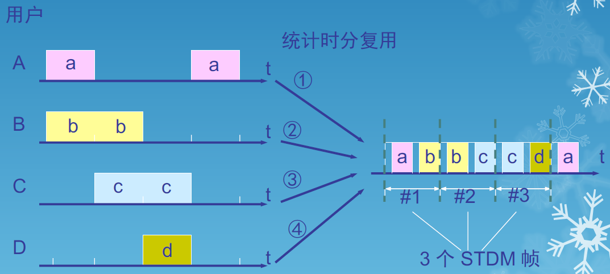

# WEEK 2

## 数据通信基础

### 数据通信系统的模型

### 常用术语

- 数据(data)——运送消息的实体
- 信号(signal)——数据的电气的或电磁的表现
- “模拟的”(analogous)——代表消息的参数的取值是连续的
- “数字的”(digital)——代表消息的参数的取值是离散的
- 码元(code)——在使用时间域（或简称为时域）的波形表示数字信号时，代表不同离散数值的基本波形

### 基本概念

- 单向通信（单工通信）——只能有一个方向的通信而没有反方向的交互
- 双向交替通信（半双工通信）——通信的双方都可以发送信息，但不能双方同时发送(当然也就不能同时接收)
- 双向同时通信（全双工通信）——通信的双方可以同时发送和接收信息
- 基带信号（即基本频带信号）——来自信源的信号。像计算机输出的代表各种文字或图像文件的数据信号都属于基带信号
- 基带信号往往包含有较多的低频成分，甚至有直流成分，而许多信道并不能传输这种低频分量或直流分量。因此必须对基带信号进行调制(modulation)
- 带通信号——把基带信号经过载波调制后，把信号的频率范围搬移到较高的频段以便在信道中传输（即仅在一段频率范围内能够通过信道）

### 最基本的带通调制方法

- 最基本的二元调制方法
  - 调幅(AM)：载波的振幅随基带数字信号而变化
  - 调频(FM)：载波的频率随基带数字信号而变化
  - 调相(PM)：载波的初始相位随基带数字信号而变化

### 信道的极限容量

- 任何实际的信道都不是理想的，在传输信号时会产生各种失真以及带来多种干扰
- 码元传输的速率越高，或信号传输的距离越远，在信道的输出端的波形的失真就越严重

### 限制码元传输速率的因素

- 信道能够通过的频率范围
  - 奈氏准则：在假定的理想条件下，为了避免码间串扰，码元的传输速率的上限值
  - 在任何信道中，码元传输的速率是有上限的，否则就会出现码间串扰的问题，使接收端对码元的判决（即识别）成为不可能
  - 如果信道的频带越宽，也就是能够通过的信号高频分量越多，那么就可以用更高的速率传送码元而不出现码间串扰
- 信噪比
  - 信噪比$=10\log_{10}(S/N)\quad dB$
  - 香农(Shannon)用信息论的理论推导出了带宽受限且有高斯白噪声干扰的信道的极限、无差错的信息传输速率
  - 信道的极限信息传输速率$C=W\log_2(1+S/N)\quad b/s$
    - $W$为信道的带宽(以Hz为单位)
    - $S$为信道内所传信号的平均功率
    - $N$为信道内部的高斯噪声功率

### 香农公式

- 信道的带宽或信道中的信噪比越大，则信息的极限传输速率就越高
- 只要信息传输速率低于信道的极限信息传输速率，就一定可以找到某种办法来实现无差错的传输
- 若信道带宽$W$或信噪比$S/N$没有上限（当然实际信道不可能是这样的），则信道的极限信息传输速率C也就没有上限
- 实际信道上能够达到的信息传输速率要比香农的极限传输速率低不少
- 对于频带宽度已确定的信道，如果信噪比不能再提高了，并且码元传输速率也达到了上限值，那么还有办法提高信息的传输速率。这就是用编码的方法让每一个码元携带更多比特的信息量

---

## 信道复用技术

### 频分复用FDM

- Frequency Division Multiplexing
- 用户在分配到一定的频带后，在通信过程中自始至终都占用这个频带
- 频分复用的所有用户在同样的时间占用不同的带宽资源（请注意，这里的“带宽”是频率带宽而不是数据的发送速率）

### 时分复用TDM

- Time Division Multiplexing
- 时分复用则是将时间划分为一段段等长的时分复用帧（TDM帧）。每一个时分复用的用户在每一个TDM帧中占用固定序号的时隙
- 每一个用户所占用的时隙是周期性地出现（其周期就是TDM帧的长度）
- TDM信号也称为等时(isochronous)信号
- 时分复用的所有用户是在不同的时间占用同样的频带宽度

- 使用时分复用系统传送计算机数据时，由于计算机数据的突发性质，用户对分配到的子信道的利用率一般是不高的
- 统计时分复用STDM

### 波分复用WDM

- Wavelength Division Multiplexing
- 波分复用是光的频分复用

### 码分复用CDM

- Code Division Multiplexing
- 码分多址CDMA(Code Division Multiple Access)
- 各用户使用经过特殊挑选的不同码型，因此彼此不会造成干扰
- 这种系统发送的信号有很强的抗干扰能力，其频谱类似于白噪声，不易被敌人发现
- 每一个比特时间划分为$m$个短的间隔，称为码片(chip)

### 码片序列(chip sequence)

- 每个站被指派一个唯一的 $m$ bit 码片序列
  - 如发送比特1，则发送自己的 $m$ bit 码片序列
  - 如发送比特0，则发送该码片序列的二进制反码

### CDMA的重要特点

- 每个站分配的码片序列不仅必须各不相同，并且还必须互相正交(orthogonal)

- 令向量$S$表示站$S$的码片向量，令$T$表示其他任何站的码片向量，两个不同站的码片序列正交，就是向量$S$和$T$的规格化内积(inner product)都是0
  $$
  S\cdot T=\frac{1}{m}\sum^m_{i=1}S_iT_i=0
  $$

### 正交关系重要特性

- 任何一个码片向量和该码片向量自己的规格化内积都是1
  $$
  S\cdot S=\frac{1}{m}\sum^m_{i=1}S_iS_i=\frac{1}{m}\sum^m_{i=1}S_i^2=\frac{1}{m}\sum(\pm1)^2=1
  $$

- 一个码片向量和该码片反码的向量的规格化内积值是–1

### CDMA的工作原理

---

## 数字传输系统

### 脉码调制PCM体制

- 脉码调制PCM 体制最初是为了在电话局之间的中继线上传送多路的电话
- 由于历史上的原因，PCM 有两个互不兼容的国际标准，即北美的24 路PCM（简称为T1）和欧洲的30 路PCM（简称为E1）。我国采用的是欧洲的E1 标准
- E1 的速率是2.048 Mb/s，而T1 的速率是1.544 Mb/s。
- 当需要有更高的数据率时，可采用复用的方法

---

## 同步光纤网

### PCM缺点

- 速率标准不统一
  - 如果不对高次群的数字传输速率进行标准化，国际范围的高速数据传输就很难实现
- 不是同步传输
  - 在过去相当长的时间，为了节约经费，各国的数字网主要是采用准同步方式

### SONET

- 同步光纤网SONET (Synchronous Optical Network) 的各级时钟都来自一个非常精确的主时钟
- 第1级同步传送信号STS-1 (Synchronous Transport Signal)的传输速率是51.84 Mb/s
- 光信号则称为第1 级光载波OC-1，OC表示Optical Carrier

### 同步数字系列SDH

- 国际电信联盟远程通信标准化组织（ITU-T）以美国标准SONET为基础，制订出国际标准同步数字系列SDH (Synchronous Digital Hierarchy)
- 一般可认为SDH与SONET是同义词
- SDH 的基本速率为155.52 Mb/s，称为第1级同步传递模块(Synchronous Transfer Module)，即STM-1，相当于SONET体系中的OC-3速率

### 四个光接口层

- 光子层(Photonic Layer)
  - 处理跨越光缆的比特传送
- 段层(Section Layer)
  - 在光缆上传送STS-N帧
- 线路层(Line Layer)
  - 负责路径层的同步和复用
- 路径层(Path Layer)
  - 处理路径端接设备PTE (Path Terminating Element)之间的业务的传输

---

## 宽带接入技术

### xDSL技术

- xDSL技术就是用数字技术对现有的模拟电话用户线进行改造，使它能够承载宽带业务
- 虽然标准模拟电话信号的频带被限制在300~3400 Hz 的范围内，但用户线本身实际可通过的信号频率仍然超过1 MHz
- xDSL技术就把0~4 kHz 低端频谱留给传统电话使用，而把原来没有被利用的高端频谱留给用户上网使用
- DSL 就是数字用户线(Digital Subscriber Line)的缩写。而DSL 的前缀x 则表示在数字用户线上实现的不同宽带方案

### xDSL的类型

- ADSL (Asymmetric Digital Subscriber Line)：非对称数字用户线
- HDSL (High speed DSL)：高速数字用户线
- SDSL (Single-line DSL)：1 对线的数字用户线
- VDSL (Very high speed DSL)：甚高速数字用户线
- DSL：综合业务数字网（Integrated Services Digital Network，ISDN）用户线
- RADSL (Rate-Adaptive DSL)：速率自适应DSL，是ADSL的一个子集，可自动调节线路速41率）

### ADSL的极限传输距离

- ADSL的极限传输距离与数据率以及用户线的线径都有很大的关系（用户线越细，信号传输时的衰减就越大），而所能得到的最高数据传输速率与实际的用户线上的信噪比密切相关

### ADSL的特点

- 上行和下行带宽做成不对称
- 上行指从用户到ISP，而下行指从ISP 到用户
- ADSL 在用户线（铜线）的两端各安装一个ADSL 调制解调器
- 我国目前采用的方案是离散多音调DMT(Discrete Multi-Tone)调制技术。这里的“多音调”就是“多载波”或“多子信道”的意思

### DMT技术

- DMT调制技术采用频分复用的方法，把40 kHz以上一直到1.1 MHz 的高端频谱划分为许多的子信道，其中25 个子信道用于上行信道，而249个子信道用于下行信道
- 每个子信道占据4 kHz 带宽（严格讲是4.3125 kHz），并使用不同的载波（即不同的音调）进行数字调制。这种做法相当于在一对用户线上使用许多小的调制解调器并行地传送数据

### DMT技术的频谱分布

### ADSL的数据率

- 由于用户线的具体条件往往相差很大（距离、线径、受到相邻用户线的干扰程度等都不同），因此ADSL 采用自适应调制技术使用户线能够传送尽可能高的数据率
- 当ADSL 启动时，用户线两端的ADSL 调制解调器就测试可用的频率、各子信道受到的干扰情况，以及在每一个频率上测试信号的传输质量
- ADSL 不能保证固定的数据率。对于质量很差的用户线甚至无法开通ADSL
- 通常下行数据率在32 kb/s 到6.4 Mb/s 之间，而上行数据率在 32 kb/s 到 640 kb/s 之间

### ADSL的组成

- 数字用户接入线复用器DSLAM(DSL Access Multiplexer)
- 接入端接单员ATU(Access Termination Unit)
- ATU-C(C代表端局Central Office)
- ATU-R(R代表远端Remote)
- 电话分离器PS(POTS Splitter)

### 第二代ADSL

- 通过提高调制效率得到了更高的数据率
- 采用了无缝速率自适应技术SRA (Seamless Rate Adaptation)，可在运营中不中断通信和不产生误码的情况下，自适应地调整数据率
- 改善了线路质量评测和故障定位功能，这对提高网络的运行维护水平具有非常重要的意义

### 光纤同轴混合网HFC(Hybrid Fiber Coax)

- HFC 网是在目前覆盖面很广的有线电视网CATV的基础上开发的一种居民宽带接入网
- HFC 网除可传送CATV 外，还提供电话、数据和其他宽带交互型业务
- 现有的CATV 网是树形拓扑结构的同轴电缆网络，它采用模拟技术的频分复用对电视节目进行单向传输。而HFC 网则需要对CATV 网进行改造

### HFC的主要特点

- HFC网的主干线路采用光纤

  - HFC网将原CATV网中的同轴电缆主干部分改换为光纤，并使用模拟光纤技术
  - 在模拟光纤中采用光的振幅调制AM，这比使用数字光纤更为经济
  - 模拟光纤从头端连接到光纤结点(fiber node)，即光分配结点ODN (Optical Distribution Node)。在光纤结点光信号被转换为电信号。在光纤结点以下就是同轴电缆

- HFC网采用结点体系结构

  

- HFC网具有比CATV 网更宽的频谱，且具有双向传输功能

  

- 每个家庭要安装一个用户接口盒UIB (User Interface Box)，UIB要提供三种连接：

  - 使用同轴电缆连接到机顶盒(set-top box)，然后再连接到用户的电视机
  - 使用双绞线连接到用户的电话机
  - 使用电缆调制解调器连接到用户的计算机

### 电缆调制解调器

- 电缆调制解调器(cable modem)是为HFC 网而使用的调制解调器
- 电缆调制解调器最大的特点就是传输速率高。其下行速率一般在3~10 Mb/s之间，最高可达30 Mb/s，而上行速率一般为0.2~2 Mb/s，最高可达10 Mb/s
- 电缆调制解调器比在普通电话线上使用的调制解调器要复杂得多，并且不是成对使用，而是只安装在用户端

### FTTx技术

- FTTx是一种实现宽带居民接入网的方案，x可代表不同意思
- 光纤到家FTTH (Fiber To The Home)：光纤一直铺设到用户家庭可能是居民接入网最后的解决方法
- 光纤到大楼FTTB (Fiber To The Building)：光纤进入大楼后就转换为电信号，然后用电缆或双绞线分配到各用户
- 光纤到路边FTTC (Fiber To The Curb)：从路边到各用户可使用星形结构双绞线作为传输媒体