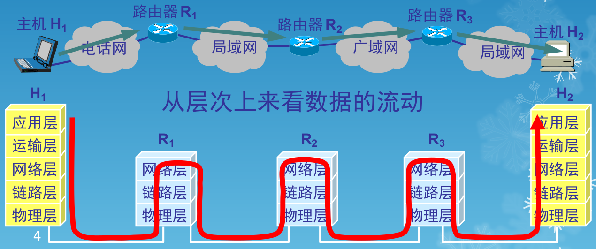

# WEEK 3

## 数据链路层基本概念

### 信道

- 点对点信道。这种信道使用一对一的点对点通信方式
- 广播信道。这种信道使用一对多的广播通信方式，因此过程比较复杂。广播信道上连接的主机很多，因此必须使用专用的共享信道协议来协调这些主机的数据发送

### 简单模型

### 数据链路

- 链路(link)是一条无源的点到点的物理线路段，中间没有任何其他的交换结点
  - 一条链路只是一条通路的一个组成部分
- 数据链路(data link) 除了物理线路外，还必须有通信协议来控制这些数据的传输。若把实现这些协议的硬件和软件加到链路上，就构成了数据链路
  - 现在最常用的方法是使用适配器（即网卡）来实现这些协议的硬件和软件
  - 一般的适配器都包括了数据链路层和物理层这两层的功能

### 帧

- 常常在两个对等的数据链路层之间画出一个数字管道，而在这条数字管道上传输的数据单位是帧
- 早期的数据通信协议曾叫作通信规程(procedure)。因此在数据链路层，规程和协议是同义语

### 封装成帧

- 封装成帧(framing)就是在一段数据的前后分别添加首部和尾部，然后就构成了一个帧。确定帧的界限

- 首部和尾部的一个重要作用就是进行帧定界

### 透明传输

### 解决透明传输问题

- 发送端的数据链路层在数据中出现控制字符“SOH”或“EOT”的前面插入一个转义字符“ESC”(其十六进制编码是1B)
- 字节填充(byte stuffing)或字符填充(character stuffing)——接收端的数据链路层在将数据送往网络层之前删除插入的转义字符
- 如果转义字符也出现数据当中，那么应在转义字符前面插入一个转义字符。当接收端收到连续的两个转义字符时，就删除其中前面的一个

### 差错检测

- 在传输过程中可能会产生比特差错——1可能会变成0而0也可能变成1
- 在一段时间内，传输错误的比特占所传输比特总数的比率称为误码率(BER, Bit Error Rate)
- 误码率与信噪比有很大的关系，信噪比越大误码率越小
- 为了保证数据传输的可靠性，在计算机网络传输数据时，必须采用各种差错检测措施

### 循环冗余检验

- 在数据链路层传送的帧中，广泛使用了循环冗余检验(CRC, Cyclic Redundancy Check)的检错技术
- 在发送端，先把数据划分为组。假定每组k个比特
- 假设待传送的一组数据M = 101001(现在k = 6)。在M 的后面再添加供差错检测用的n位冗余码一起发送

### 帧检测序列FCS

- 在数据后面添加上的冗余码称为帧检验序列(FCS, Frame Check Sequence)

- 循环冗余检验CRC 和帧检验序列FCS并不等同
  - CRC是一种常用的检错方法，而FCS是添加在数据后面的冗余码
  - FCS可以用CRC这种方法得出，但CRC并非用来获得FCS的唯一方法

> 注意：
>
> - 仅用循环冗余检验CRC差错检测技术只能做到无差错接受
> - “无差错接受”是指：“凡是接受的帧（即不包括丢弃的帧），我们都能以非常接近于1的概率认为这些帧在传输过程中没有产生差错”
> - “凡是接收端数据链路层接受的帧都没有传输差错”（有差错的帧就丢弃而不接受）
> - 要做到“可靠传输”（即发送什么就收到什么）就必须再加上确认和重传机制

---

## 点对点协议PPP

### 特点

- 全世界使用得最多的数据链路层协议是点对点协议PPP (Point-to-Point Protocol)
- 用户使用拨号电话线接入因特网时，一般都是使用PPP协议

### 应满足的需求

- 简单——这是首要的要求
- 封装成帧
- 透明性
- 多种网络层协议
- 多种类型链路
- 差错检测
- 检测连接状态
- 最大传送单元
- 网络层地址协商
- 数据压缩协商

### 不需要的功能

- 纠错
- 流量控制
- 序号
- 多点线路
- 半双工或单工链路

### 组成

- 一个将 IP 数据报封装到串行链路的的方法
- 链路控制协议(LCP, Link Control Protocol)
- 网络控制协议(NCP, Network Control Protocol)

### 帧格式

- 标志字段F = 0x7E （符号“0x”表示后面的字符是用十六进制表示。十六进制的7E的二进制表示是01111110）
- 地址字段A只置为0xFF。地址字段实际上并不起作用
- 控制字段C通常置为0x03
- PPP 是面向字节的，所有的 PPP 帧的长度都是整数字节

- PPP 有一个2个字节的协议字段
  - 当协议字段为0x0021时，PPP帧的信息字段就是IP数据报
  - 若为0xC021，则信息字段是PPP链路控制数据
  - 若为0x8021，则表示是网络控制数据

### 字节填充

- 当 PPP 用在同步传输链路时，协议规定采用硬件来完成比特填充
- 当 PPP 用在异步传输时，就使用一种特殊的字节填充法
- 将信息字段中出现的每一个0x7E字节转变成为2 字节序列(0x7D, 0x5E)
- 若信息字段中出现一个0x7D的字节, 则将其转变成为2字节序列(0x7D, 0x5D)
- 若信息字段中出现ASCII 码的控制字符（即数值小于0x20 的字符），则在该字符前面要加入一个0x7D 字节，同时将该字符的编码加以改变

### 零比特填充

- PPP 协议用在SONET/SDH 链路时，是使用同步传输（一连串的比特连续传送）。这时PPP协议采用零比特填充方法来实现透明传输
- 在发送端，只要发现有5个连续1，则立即填入一个0。接收端对帧中的比特流进行扫描。每当发现5个连续1时，就把这5个连续1后的一个0删除

---

## 使用广播信道的数据链路层

### 局域网的数据链路层

- 局域网最主要的特点是:网络为一个单位所拥有,且地理范围和站点数目均有限

- 局域网具有如下的一些主要优点：

  - 具有广播功能，从一个站点可很方便地访问全网。局域网上的主机可共享连接在局域网上的各种硬件和软件资源
  - 便于系统的扩展和逐渐地演变，各设备的位置可灵活调整和改变
  - 提高了系统的可靠性、可用性和残存性

- 拓扑结构

  

- 适配器的作用

  - 网络接口板又称为通信适配器(adapter)或网络接口卡(NIC, Network Interface Card),或“网卡”
  - 适配器的重要功能
    - 进行串行/并行转换
    - 对数据进行缓存
    - 在计算机的操作系统安装设备驱动程序
    - 实现以太网协议

### CSMA/CD协议

- 最初的以太网是将许多计算机都连接到一根总线上。当初认为这样的连接方法既简单又可靠,因为总线上没有有源器件

  

- 总线上的每一个工作的计算机都能检测到 B 发送的数据信号

- 由于只有计算机 D 的地址与数据帧首部写入的地址一致,因此只有 D 才接收这个数据帧

- 其他所有的计算机(A, C 和 E)都检测到不是发送给它们的数据帧,因此就丢弃这个数据帧而不能够收下来

- 具有广播特性的总线上实现了一对一的通信

#### 以太网两种重要措施

- **采用较为灵活的无连接的工作方式,即不必先建立连接就可以直接发送数据**

- 以太网对发送的数据帧不进行编号,也不要求对方发回确认

  - 这样做的理由是局域网信道的质量很好，因信道质量产生差错的概率是很小的

- 以太网提供的服务是不可靠的交付,即尽最大努力的交付

- 当目的站收到有差错的数据帧时就丢弃此帧,其他什么也不做。差错的纠正由高层来决定

- 如果高层发现丢失了一些数据而进行重传,但以太网并不知道这是一个重传的帧,而是当作一个新的数据帧来发送

- **以太网发送的数据都使用曼彻斯特(Manchester)编码**

  

#### 概念

- CSMA/CD 表示 Carrier Sense Multiple Access with Collision Detection;载波监听多点接入/碰撞检测
- “多点接入”表示许多计算机以多点接入的方式连接在一根总线上
- “载波监听”是指每一个站在发送数据之前先要检测一下总线上是否有其他计算机在发送数据,如果有,则暂时不要发送数据,以免发生碰撞
- 总线上并没有什么“载波”。因此, “载波监听”就是用电子技术检测总线上有没有其他计算机发送的数据信号

#### 碰撞检测

- “碰撞检测”就是计算机边发送数据边检测信道上的信号电压大小
- 当几个站同时在总线上发送数据时,总线上的信号电压摆动值将会增大(互相叠加)
- 当一个站检测到的信号电压摆动值超过一定的门限值时,就认为总线上至少有两个站同时在发送数据,表明产生了碰撞
- 所谓“碰撞”就是发生了冲突。因此“碰撞检测”也称为“冲突检测”
- 在发生碰撞时,总线上传输的信号产生了严重的失真,无法从中恢复出有用的信息来
- 每一个正在发送数据的站,一旦发现总线上出现了碰撞,就要立即停止发送,免得继续浪费网络资源,然后等待一段随机时间后再次发送

#### 电磁波在总线上的有限传播速率的影响

- 当某个站监听到总线是空闲时,也可能总线并非真正是空闲的
- A 向 B 发出的信息,要经过一定的时间后才能传送到 B
- B 若在 A 发送的信息到达 B 之前发送自己的帧(因为这时 B 的载波监听检测不到 A 所发送的信息),则必然要在某个时间和 A 发送的帧发生碰撞
- 碰撞的结果是两个帧都变得无用

#### 传播时延对载波监听的影响

#### 重要特性

- 使用 CSMA/CD 协议的以太网不能进行全双工通信而只能进行双向交替通信(半双工通信)
- 每个站在发送数据之后的一小段时间内,存在着遭遇碰撞的可能性
- 这种发送的不确定性使整个以太网的平均通信量远小于以太网的最高数据率

#### 争用期

- 最先发送数据帧的站,在发送数据帧后至多经过时间 $2\tau$ (两倍的端到端往返时延)就可知道发送的数据帧是否遭受了碰撞
- 以太网的端到端往返时延 $2\tau$ 称为争用期,或碰撞窗口
- 经过争用期这段时间还没有检测到碰撞,才能肯定这次发送不会发生碰撞

#### 争用期的长度

- 以太网取 51.2 μs 为争用期的长度
- 对于 10 Mb/s 以太网,在争用期内可发送512 bit,即 64 字节
- 以太网在发送数据时,若前 64 字节没有发生冲突,则后续的数据就不会发生冲突

#### 最短有效帧长

- 如果发生冲突,就一定是在发送的前 64 字节之内
- 由于一检测到冲突就立即中止发送,这时已经发送出去的数据一定小于 64 字节
- 以太网规定了最短有效帧长为 64 字节,凡长度小于 64 字节的帧都是由于冲突而异常中止的无效帧

#### 人为干扰信号

- B 也能检测到冲突，并立即停止发送数据帧，接着就发送干扰信号。这里为了简单起见，只画出 A 发送干扰信号的情况

---

## 使用广播信道的以太网

### 使用集线器的星形拓扑

- 传统以太网最初是使用粗同轴电缆,后来演进到使用比较便宜的细同轴电缆,最后发展为使用更便宜和更灵活的双绞线
- 这种以太网采用星形拓扑,在星形的中心则增加了一种可靠性非常高的设备,叫做集线器(hub)

### 使用集线器的双绞线以太网

### 集线器的特点

- 集线器是使用电子器件来模拟实际电缆线的工作,因此整个系统仍然像一个传统的以太网那样运行
- 使用集线器的以太网在逻辑上仍是一个总线网,各工作站使用的还是 CSMA/CD 协议,并共享逻辑上的总线
- 集线器很像一个多接口的转发器,工作在物理层

### 以太网的信道利用率

- 以太网的信道被占用的情况

- 争用期长度为 $2\tau$ ,即端到端传播时延的两倍。检测到碰撞后不发送干扰信号

- 帧长为 $L$ (bit),数据发送速率为 $C$ (b/s),因而帧的发送时间为 $L/C = T_0 (s)$

- 一个帧从开始发送,经可能发生的碰撞后,将再重传数次,到发送成功且信道转为空闲(即再经过时间 t 使得信道上无信号在传播)时为止,是发送一帧所需的平均时间

- 参数 a

  - 要提高以太网的信道利用率,就必须减小 $\tau$ 与 $T_0$ 之比。在以太网中定义了参数 $a$,它是以太网单程端到端时延 $\tau$ 与帧的发送时间 $T_0$ 之比
    $$
    a=\frac\tau{T_0}
    $$

  - $a\rarr0$ 表示一发生碰撞就立即可以检测出来,并立即停止发送,因而信道利用率很高

  - $a$ 越大,表明争用期所占的比例增大,每发生一次碰撞就浪费许多信道资源,使得信道利用率明显降低

### 对以太网参数的要求

- 当数据率一定时,以太网的连线的长度受到限制,否则 $\tau$ 的数值会太大
- 以太网的帧长不能太短,否则 $T_0$ 的值会太小,使 $a$ 值太大

### 信道利用率的最大值 $S_{max}$

- 在理想化的情况下,以太网上的各站发送数据都不会产生碰撞(这显然已经不是 CSMA/CD,而是需要使用一种特殊的调度方法),即总线一旦空闲就有某一个站立即发送数据

- 发送一帧占用线路的时间是 $T_0 + \tau$ ,而帧本身的发送时间是 $T_0$。于是我们可计算出理想情况下的极限信道利用率 $S_{max}$ 为：
  $$
  S_{max}=\frac{T_0}{T_o+\tau}=\frac 1{1+a}
  $$

### 以太网的 MAC 层

#### 帧间最小间隔

- 帧间最小间隔为 9.6 μs,相当于 96 bit 的发送时间
- 一个站在检测到总线开始空闲后,还要等待 9.6 μs 才能再次发送数据
- 这样做是为了使刚刚收到数据帧的站的接收缓存来得及清理,做好接收下一帧的准备

#### MAC 层的硬件地址

- 在局域网中,硬件地址又称为物理地址,或 MAC地址
- 802 标准所说的“地址”严格地讲应当是每一个站的“名字”或标识符
- 但鉴于大家都早已习惯了将这种 48 位的“名字”称为“地址”,所以本我们也采用这种习惯用法,尽管这种说法并不太严格

#### 48 位的 MAC 地址

- IEEE 的注册管理机构 RA 负责向厂家分配地址字段的前三个字节(即高位 24 位)
- 地址字段中的后三个字节(即低位 24 位)由厂家自行指派,称为扩展标识符,必须保证生产出的适配器没有重复地址
- 一个地址块可以生成2 24 个不同的地址。这种 48位地址称为 MAC-48,它的通用名称是EUI-48
- “MAC地址”实际上就是适配器地址或适配器标识符EUI-48

#### 适配器检查 MAC 地址

- 适配器从网络上每收到一个 MAC 帧就首先用硬件检查 MAC 帧中的 MAC 地址
  - 如果是发往本站的帧则收下，然后进行其它处理
  - 否则就将此帧丢弃，不再进行其它处理
- 发往本站的帧”包括以下三种帧：
  - 单播(unicast)帧(一对一)
  - 广播(boradcsat)帧(一对全体)
  - 多播(muticast)帧(一对多)

#### MAC 帧的格式

- 常用的以太网MAC帧格式有两种标准：

  - DIX Ethernet V2 标准
  - IEEE 的 802.3 3  标准

- 最常用的 MAC 帧是以太网 V2 的格式

  

- 在帧的前面插入的8字节中的第一个字段共7个字节，是前同步码，用来迅速实现 MAX 帧的比特同步。第二个字段是帧开始定界符，表示后面的信息就是 MAC 帧

#### 无效的 MAC 帧

- 数据字段的长度与长度字段的值不一致
- 帧的长度不是整数个字节
- 用收到的帧检验序列 FCS 查出有差错
- 数据字段的长度不在 46 ~ 1500 字节之间
- 有效的 MAC 帧长度为 64 ~ 1518 字节之间
- 对于检查出的无效 MAC 帧就简单地丢弃。以太网不负责重传丢弃的帧

---

## 在物理层扩展以太网

- 主机使用光纤和一对光纤调制解调器连接到集线器

  

### 多个集线器

- 某大学有三个系,各自有一个局域网

  

### 集线器扩展局域网优缺点

- 优点
  - 使原来属于不同碰撞域的局域网上的计算机能够进行跨碰撞域的通信
  - 扩大了局域网覆盖的地理范围
- 缺点
  - 碰撞域增大了，但总的吞吐量并为提高
  - 如果不同的碰撞域使用不同的数据率，那么就不能用集线器将它们互连起来

---

## 在数据链路层扩展以太网

- 在数据链路层扩展局域网是使用网桥
- 网桥工作在数据链路层,它根据 MAC 帧的目的地址对收到的帧进行转发
- 网桥具有过滤帧的功能。当网桥收到一个帧时,并不是向所有的接口转发此帧,而是先检查此帧的目的 MAC 地址,然后再确定将该帧转发到哪一个接口

### 网桥内部的结构

### 使用网桥的好处

- 过滤通信量
- 扩大了物理范围
- 提高了可靠性
- 可互连不同物理层、不同 MAC 子层和不同速率(如10 Mb/s 和 100 Mb/s 以太网)的局域网

### 网桥隔离碰撞域

### 网桥的缺点

- 存储转发增加了时延
- 在MAC 子层并没有流量控制功能
- 具有不同 MAC 子层的网段桥接在一起时时延更大
- 网桥只适合于用户数不太多(不超过几百个)和通信量不太大的局域网,否则有时还会因传播过多的广播信息而产生网络拥塞。这就是所谓的广播风暴

### 网桥和集线器

- 集线器在转发帧时,不对传输媒体进行检测
- 网桥在转发帧之前必须执行 CSMA/CD 算法
  - 若在发送过程中出现碰撞，就必须停止发送和进行退避

### 透明网桥

- 目前使用得最多的网桥是透明网桥(transparentbridge)
- “透明”是指局域网上的站点并不知道所发送的帧将经过哪几个网桥,因为网桥对各站来说是看不见的
- 透明网桥是一种即插即用设备,其标准是 IEEE 802.1D

### 网桥自学习算法

- 若从 A 发出的帧从接口 x 进入了某网桥,那么从这个接口出发沿相反方向一定可把一个帧传送到 A
- 网桥每收到一个帧,就记下其源地址和进入网桥的接口,作为转发表中的一个项目
- 在建立转发表时是把帧首部中的源地址写在“地址”这一栏的下面
- 在转发帧时,则是根据收到的帧首部中的目的地址来转发的。这时就把在“地址”栏下面已经记下的源地址当作目的地址,而把记下的进入接口当作转发接口

### 网桥在转发表中登记三个信息

- 在网桥的转发表中写入的信息除了地址和接口外,还有帧进入该网桥的时间
- 这是因为以太网的拓扑可能经常会发生变化,站点也可能会更换适配器(这就改变了站点的地址)。另外,以太网上的工作站并非总是接通电源的
- 把每个帧到达网桥的时间登记下来,就可以在转发表中只保留网络拓扑的最新状态信息。这样就使得网桥中的转发表能反映当前网络的最新拓扑状态

### 网桥的自学习和转发帧

- 网桥收到一帧后先进行自学习。查找转发表中与收到帧的源地址有无相匹配的项目。如没有,就在转发表中增加一个项目(源地址、进入的接口和时间)。如有,则把原有的项目进行更新
- 转发帧。查找转发表中与收到帧的目的地址有无相匹配的项目
  - 如没有，则通过所有其他接口(但进入网桥的接口除外)按进行转发
  - 如有，则按转发表中给出的接口进行转发
  - 若转发表中给出的接口就是该帧进入网桥的接口，则应丢弃这个帧(因为这时不需要经过网桥进行转发)

### 源路由网桥

- 透明网桥容易安装,但网络资源的利用不充分
- 源路由(source route)网桥在发送帧时将详细的路由信息放在帧的首部中
- 源站以广播方式向欲通信的目的站发送一个发现帧,每个发现帧都记录所经过的路由
- 发现帧到达目的站时就沿各自的路由返回源站。源站在得知这些路由后,从所有可能的路由中选择出一个最佳路由。凡从该源站向该目的站发送的帧的首部,都必须携带源站所确定的这一路由信息

### 多接口网桥

- 1990 年问世的交换式集线器(switching hub),可明显地提高局域网的性能
- 交换式集线器常称为以太网交换机(switch)或第二层交换机(表明此交换机工作在数据链路层)
- 以太网交换机通常都有十几个接口。因此,以太网交换机实质上就是一个多接口的网桥,可见交换机工作在数据链路层

### 以太网交换机的特点

- 以太网交换机的每个接口都直接与主机相连,并且一般都工作在全双工方式
- 交换机能同时连通许多对的接口,使每一对相互通信的主机都能像独占通信媒体那样,进行无碰撞地传输数据
- 以太网交换机由于使用了专用的交换结构芯片,其交换速率就较高

### 以太网交换机扩展局域网

### 以太网交换机实现虚拟局域网

- 虚拟局域网 VLAN 是由一些局域网网段构成的与物理位置无关的逻辑组
  - 这些网段具有某些共同的需求
  - 每一个 VLAN 的帧都有一个明确的标识符，指明发送这个帧的工作站是属于哪一个 VLAN
- 虚拟局域网其实只是局域网给用户提供的一种服务,而并不是一种新型局域网

---

## 高速以太网

### 100BASE-T 以太网

- 速率达到或超过 100 Mb/s 的以太网称为高速以太网
- 在双绞线上传送 100 Mb/s 基带信号的星型拓扑以太网,仍使用 IEEE 802.3 的CSMA/CD 协议
- 100BASE-T 以太网又称为快速以太网(Fast Ethernet)

### 100BASE-T 以太网特点

- 可在全双工方式下工作而无冲突发生。因此,不使用 CSMA/CD 协议
- MAC 帧格式仍然是 802.3 标准规定的
- 保持最短帧长不变,但将一个网段的最大电缆长度减小到 100 m
- 帧间时间间隔从原来的 9.6 μs 改为现在的 0.96 μs

### 吉比特以太网

- 允许在 1 Gb/s 下全双工和半双工两种方式工作
- 当吉比特以太网工作在全双工方式时(即通信双方可同时进行发送和接收数据),不使用载波延伸和分组突发
- 使用 802.3 协议规定的帧格式
- 在半双工方式下使用 CSMA/CD 协议(全双工方式不需要使用 CSMA/CD 协议)
- 与 10BASE-T 和 100BASE-T 技术向后兼容

### 10吉比特以太网

- 10 吉比特以太网与 10 Mb/s,100 Mb/s 和 1 Gb/s 以太网的帧格式完全相同
- 10 吉比特以太网还保留了 802.3 标准规定的以太网最小和最大帧长,便于升级
- 10 吉比特以太网不再使用铜线而只使用光纤作为传输媒体
- 10 吉比特以太网只工作在全双工方式,因此没有争用问题,也不使用 CSMA/CD 协议

### 高速以太网的演进

- 以太网从 10 Mb/s 到 10 Gb/s 的演进证明了以太网是：
  - 可扩展的(从 10 Mb/s 到 10 Gb/s)
  - 灵活的(多种传输媒体、全/半双工、共享/交换)
  - 易于安装
  - 稳健性好