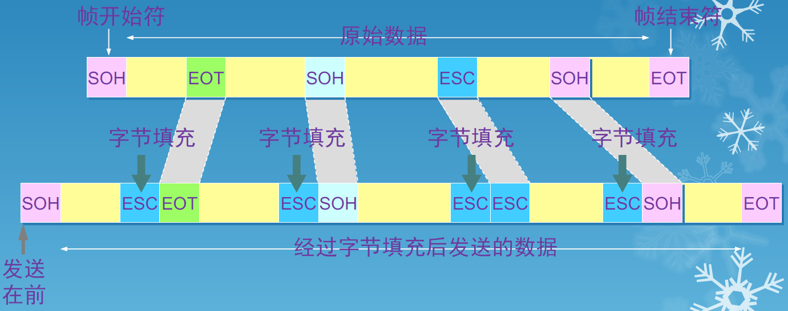

# WEEK 3

## 数据链路层基本概念

### 信道

- 点对点信道。这种信道使用一对一的点对点通信方式。
- 广播信道。这种信道使用一对多的广播通信方式，因此过程比较复杂。广播信道上连接的主机很多，因此必须使用专用的共享信道协议来协调这些主机的数据发送。

### 数据链路

- 链路(link)是一条无源的点到点的物理线路段，中间没有任何其他的交换结点
  - 一条链路只是一条通路的一个组成部分
- 数据链路(data link) 除了物理线路外，还必须有通信协议来控制这些数据的传输。若把实现这些协议的硬件和软件加到链路上，就构成了数据链路
  - 现在最常用的方法是使用适配器（即网卡）来实现这些协议的硬件和软件
  - 一般的适配器都包括了数据链路层和物理层这两层的功能

### 帧

- 常常在两个对等的数据链路层之间画出一个数字管道，而在这条数字管道上传输的数据单位是帧
- 早期的数据通信协议曾叫作通信规程(procedure)。因此在数据链路层，规程和协议是同义语

### 封装成帧

- 封装成帧(framing)就是在一段数据的前后分别添加首部和尾部，然后就构成了一个帧。确定帧的界限
- 首部和尾部的一个重要作用就是进行帧定界

### 透明传输

### 解决透明传输问题

- 发送端的数据链路层在数据中出现控制字符“SOH”或“EOT”的前面插入一个转义字符“ESC”(其十六进制编码是1B)
- 字节填充(byte stuffing)或字符填充(character stuffing)——接收端的数据链路层在将数据送往网络层之前删除插入的转义字符
- 如果转义字符也出现数据当中，那么应在转义字符前面插入一个转义字符。当接收端收到连续的两个转义字符时，就删除其中前面的一个

### 差错检测

- 在传输过程中可能会产生比特差错：1 可能会变成0而0也可能变成1
- 在一段时间内，传输错误的比特占所传输比特总数的比率称为误码率BER (Bit Error Rate)
- 误码率与信噪比有很大的关系，信噪比越大误码率越小
- 为了保证数据传输的可靠性，在计算机网络传输数据时，必须采用各种差错检测措施

### 循环冗余检验

- 在数据链路层传送的帧中，广泛使用了循环冗余检验CRC的检错技术
- 在发送端，先把数据划分为组。假定每组k个比特
- 假设待传送的一组数据M = 101001（现在k = 6）。在M 的后面再添加供差错检测用的n位冗余码一起发送

### 帧检测序列FCS

- 在数据后面添加上的冗余码称为帧检验序列FCS(Frame Check Sequence)

- 循环冗余检验CRC 和帧检验序列FCS并不等同
  - CRC是一种常用的检错方法，而FCS是添加在数据后面的冗余码
  - FCS可以用CRC这种方法得出，但CRC并非用来获得FCS的唯一方法

> 注意：
>
> - 仅用循环冗余检验CRC差错检测技术只能做到无差错接受(accept)
> - “无差错接受”是指：“凡是接受的帧（即不包括丢弃的帧），我们都能以非常接近于1 的概率认为这些帧在传输过程中没有产生差错”
> - “凡是接收端数据链路层接受的帧都没有传输差错”（有差错的帧就丢弃而不接受）
> - 要做到“可靠传输”（即发送什么就收到什么）就必须再加上确认和重传机制

---

## 点对点协议PPP

### 特点

- 全世界使用得最多的数据链路层协议是点对点协议PPP (Point-to-Point Protocol)
- 用户使用拨号电话线接入因特网时，一般都是使用PPP协议

### 应满足的需求

- 简单——这是首要的要求
- 封装成帧
- 透明性
- 多种网络层协议
- 多种类型链路
- 差错检测
- 检测连接状态
- 最大传送单元
- 网络层地址协商
- 数据压缩协商

### 不需要的功能

- 纠错
- 流量控制
- 序号
- 多点线路
- 半双工或单工链路

### 组成

- 一个将IP数据报封装到串行链路的的方法
- 链路控制协议LCP(Link Control Protocol)
- 网络控制协议NCP(Network Control Protocol)

### 帧格式

- 标志字段F = 0x7E （符号“0x”表示后面的字符是用十六进制表示。十六进制的7E的二进制表示是01111110）
- 地址字段A只置为0xFF。地址字段实际上并不起作用
- 控制字段C通常置为0x03
- PPP 是面向字节的，所有的PPP帧的长度都是整数字节

- PPP 有一个2个字节的协议字段
  - 当协议字段为0x0021时，PPP帧的信息字段就是IP数据报
  - 若为0xC021，则信息字段是PPP链路控制数据
  - 若为0x8021，则表示是网络控制数据

### 字节填充

- 当PPP 用在同步传输链路时，协议规定采用硬件来完成比特填充
- 当PPP 用在异步传输时，就使用一种特殊的字节填充法
- 将信息字段中出现的每一个0x7E 字节转变成为2 字节序列(0x7D, 0x5E)
- 若信息字段中出现一个0x7D 的字节, 则将其转变成为2字节序列(0x7D, 0x5D)
- 若信息字段中出现ASCII 码的控制字符（即数值小于0x20 的字符），则在该字符前面要加入一个0x7D 字节，同时将该字符的编码加以改变

### 零比特填充

- PPP 协议用在SONET/SDH 链路时，是使用同步传输（一连串的比特连续传送）。这时PPP协议采用零比特填充方法来实现透明传输
- 在发送端，只要发现有5个连续1，则立即填入一个0。接收端对帧中的比特流进行扫描。每当发现5个连续1时，就把这5个连续1后的一个0删除

## CSMA/CD协议

## 以太网

## 在数据链路层扩展以太网

## 高速以太网

