# WEEK 4

## 网络层

### 提供的服务

- 在计算机网络领域,网络层应该向运输层提供怎样的服务(“面向连接”还是“无连接”)曾引起了长期的争论
- 争论焦点的实质就是:在计算机通信中,可靠交付应当由谁来负责?是网络还是端系统?

### 电信网的成功经验

- 面向连接的通信方式
- 建立虚电路(Virtual Circuit),以保证双方通信所需的一切网络资源
- 如果再使用可靠传输的网络协议,就可使所发送的分组无差错按序到达终点

### 虚电路服务

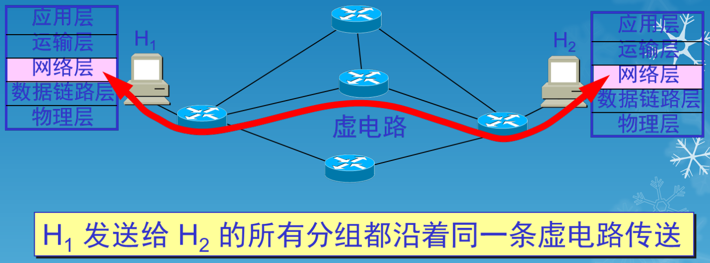

- 虚电路表示这只是一条逻辑上的连接,分组都沿着这条逻辑连接按照存储转发方式传送,而并不是真正建立了一条物理连接
- 电路交换的电话通信是先建立了一条真正的连接。因此分组交换的虚连接和电路交换的连接只是类似,但并不完全一样

### 因特网的设计思路

- 网络层向上只提供简单灵活的、无连接的、尽最大努力交付的数据报服务
- 网络在发送分组时不需要先建立连接。每一个分组(即 IP 数据报)独立发送,与其前后的分组无关(不进行编号)
- 网络层不提供服务质量的承诺。即所传送的分组可能出错、丢失、重复和失序(不按序到达终点),当然也不保证分组传送的时限

### 尽最大努力交付的含义

- 由于传输网络不提供端到端的可靠传输服务,这就使网络中的路由器可以做得比较简单,而且价格低廉(与电信网的交换机相比较)
- 如果主机(即端系统)中的进程之间的通信需要是可靠的,那么就由网络的主机中的运输层负责(包括差错处理、流量控制等)
- 采用这种设计思路的好处是:网络的造价大大降低,运行方式灵活,能够适应多种应用
- 因特网能够发展到今日的规模,充分证明了当初采用这种设计思路的正确性

### 数据报服务

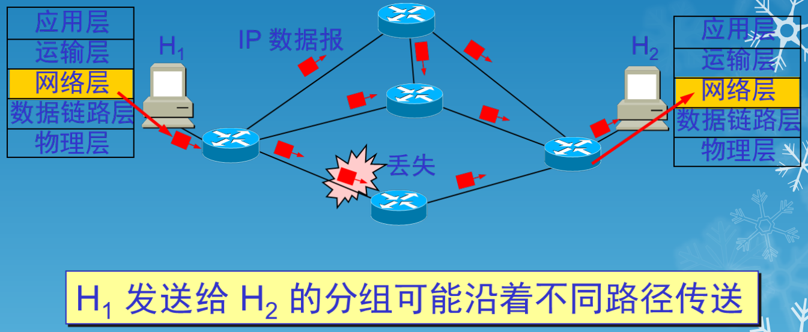

### 虚电路服务与数据报服务的对比

|         对比的方面         |                   虚电路服务                   |                     数据报服务                     |
| :------------------------: | :--------------------------------------------: | :------------------------------------------------: |
|            思路            |           可靠的通信应当由网络来保证           |            可靠通信应当由用户主机来保证            |
|         连接的建立         |                     必须有                     |                       不需要                       |
|          终点地址          | 仅在连接建立阶段使用，每个分组使用短的虚电路号 |             每个分组都有终点的完整地址             |
|         分组的转发         |  属于同一条虚电路的分组均按照同一路由进行转发  |            每个分组独立选择路由进行转发            |
|      当结点出现故障时      |     所有通过出故障的结点的虚电路均不能工作     | 出故障的结点可能会丢失分组，一些路由可能会发生变化 |
|         分组的顺序         |             总是按发送顺序到达终点             |             到达终点时不一定按发送顺序             |
| 端到端的差错处理和流量控制 |      可以由网络负责，也可以由用户主机负责      |                   由用户主机负责                   |

---

## 网际协议IP

- 网际协议 IP 是 TCP/IP 体系中两个最主要的协议之一。与 IP 协议配套使用的还有四个协议：
  - 地址解析协议(ARP, Address Resolution Protocol)
  - 逆地址解析协议(RARP, Reverse Address Resolution Protocol)
  - 网际控制报文协议(ICMP, Internet Control Message Protocol)
  - 网际组管理协议(IGMP, Internet Group Management Protocol)

### 配套协议

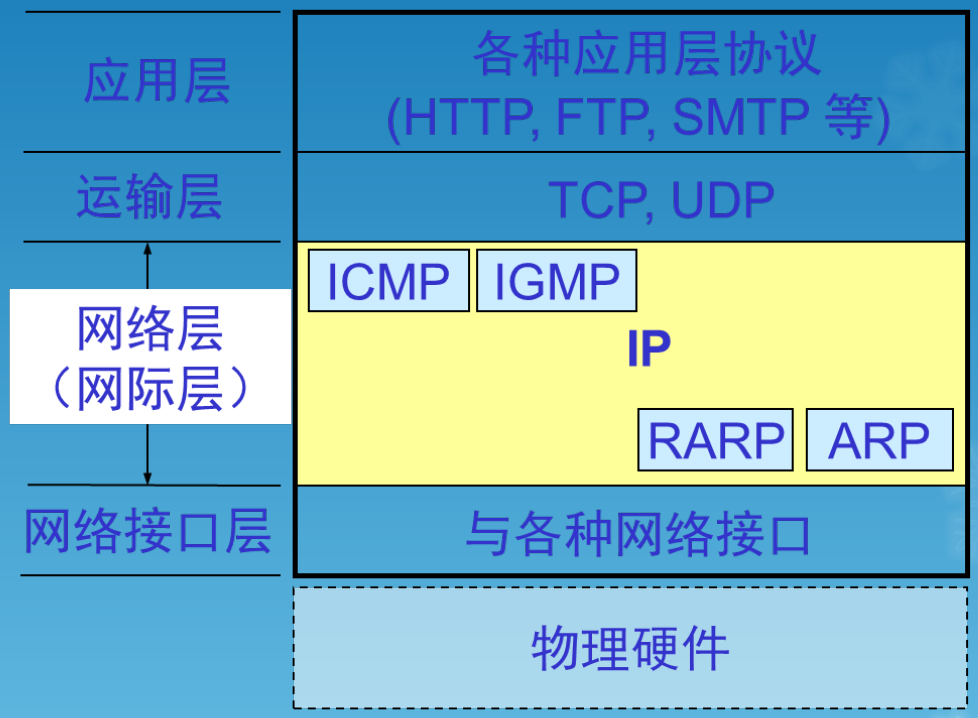

### 虚拟互连网络

- 互连在一起的网络要进行通信,会遇到许多问题需要解决：
  - 不同的寻址方案
  - 不同的最大分组长度
  - 不同的网络接入机制
  - 不同的超时控制
  - 不同的差错恢复方法
  - 不同的状态报告方法
  - 不同的路由选择技术
  - 不同的用户接入控制
  - 不同的服务(面向连接服务和无连接服务)
  - 不同的管理与控制方式
- 中间设备
  - 中间设备又称为中间系统或中继(relay)系统
  - 物理层中继系统:转发器(repeater)
  - 数据链路层中继系统:网桥或桥接器(bridge)
  - 网络层中继系统:路由器(router)
  - 网桥和路由器的混合物:桥路器(brouter)
  - 网络层以上的中继系统:网关(gateway)
  - 当中继系统是转发器或网桥时,一般并不称之为网络互连,因为这仅仅是把一个网络扩大了,而这仍然是一个网络

### 互连网络和虚拟互连网络

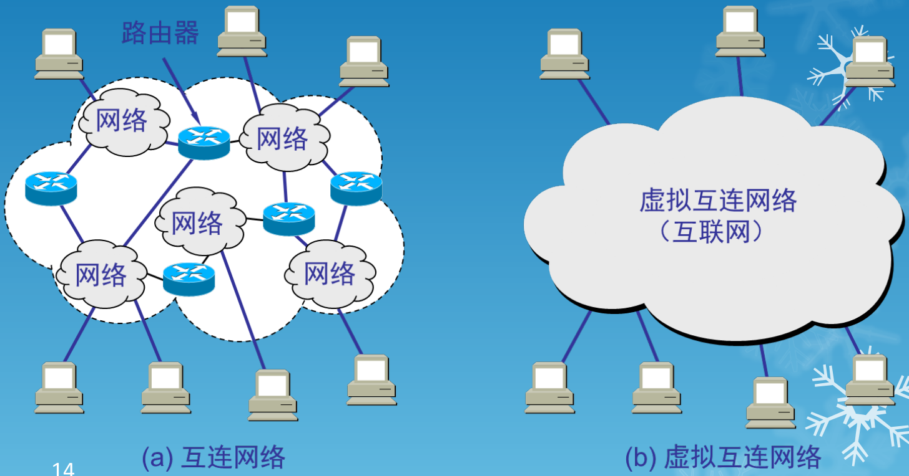

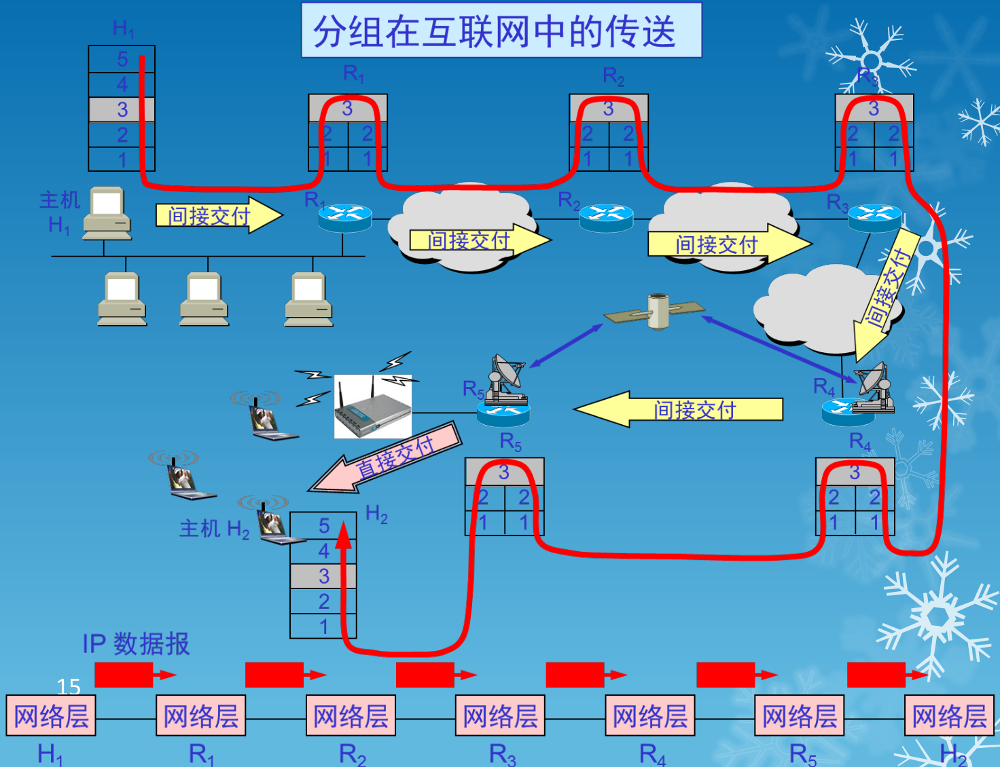

### IP 地址及其表示方法

- 我们把整个因特网看成为一个单一的、抽象的网络。IP 地址就是给每个连接在因特网上的主机(或路由器)分配一个在全世界范围是唯一的 32 位的标识符
- IP 地址现在由因特网名字与号码指派公司ICANN(Internet Corporation for Assigned Names and Numbers)进行分配

### IP 地址的编址方法

- 分类的 IP 地址
  - 这是最基本的编址方法,在 1981 年就通过了相应的标准协议
-  子网的划分
  - 这是对最基本的编址方法的改进,其标准[RFC 950]在 1985 年通过
- 构成超网
  - 这是比较新的无分类编址方法。1993 年提出后很快就得到推广应用

### 分类IP 地址

- 每一类地址都由两个固定长度的字段组成，其中一个字段是网络号net-id，它标志主机（或路由器）所连接到的网络，而另一个字段则是主机号host-id，它标志该主机（或路由器）

- 两级的IP地址可以记为：

  

### IP 地址中的网络号字段和主机号字段

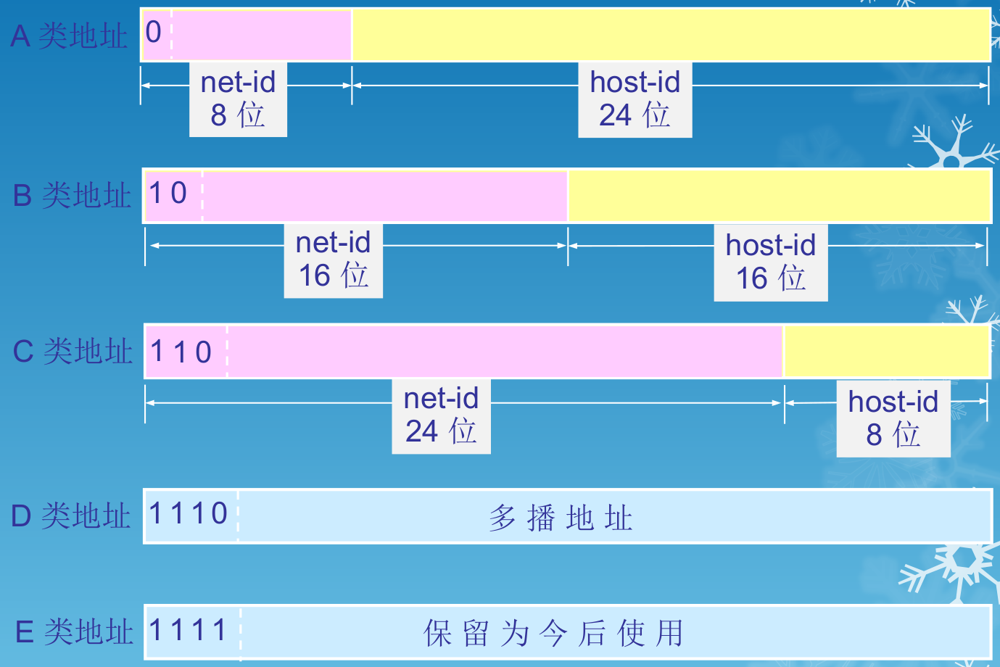

- A 类地址的网络号字段 net-id 为 1 字节，主机号字段 host-id 为 3 字节
- B 类地址的网络号字段 net-id 为 2 字节，主机号字段 host-id 为 2 字节
- C 类地址的网络号字段 net-id 为 3 字节，主机号字段 host-id 为 1 字节
- D 类地址是多播地址
- E 类地址保留为今后使用

### 点分十进制记法

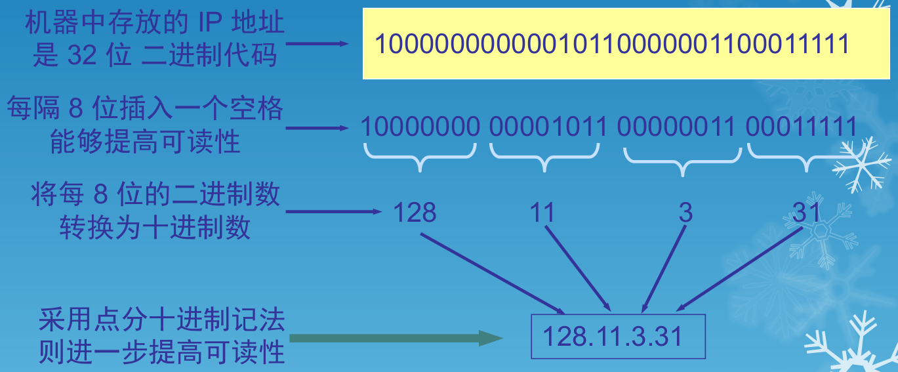

### IP 地址的使用范围

| 网络类别 |     最大的网络数      | 第一个可用的网络号 | 最后一个可用的网络号 | 每个网络中最大的主机数 |
| :------: | :-------------------: | :----------------: | :------------------: | :--------------------: |
|    A     |     $126(2^7-2)$      |         1          |         126          | $16,777,214(2^{24}-2)$ |
|    B     |  $16,383(2^{14}-1)$   |       128.1        |       191.255        |   $65,534(2^{16}-2)$   |
|    C     | $2,097,151(2^{21}-1)$ |      192.0.1       |     223.255.255      |      $254(2^8-2)$      |

> Note : 127.x.x.x 被保留为回送地址，一般用于测试使用

### IP地址的重要特点

- IP 地址是一种分等级的地址结构。分两个等级的好处是：
  - IP 地址管理机构在分配IP 地址时只分配网络号，而剩下的主机号则由得到该网络号的单位自行分配。这样就方便了IP 地址的管理
  - 路由器仅根据目的主机所连接的网络号来转发分组（而不考虑目的主机号），这样就可以使路由表中的项目数大幅度减少，从而减小了路由表所占的存储空间
- 实际上IP 地址是标志一个主机（或路由器）和一条链路的接口
  - 当一个主机同时连接到两个网络上时，该主机就必须同时具有两个相应的 IP 地址，其网络号 net-id 必须是不同的。这种主机称为多归属主机(multihomed host)
  - 由于一个路由器至少应当连接到两个网络（这样它才能将IP 数据报从一个网络转发到另一个网络），因此一个路由器至少应当有两个不同的IP地址，路由器的每一个接口都有一个不同网络号的 IP 地址
  - 两个路由器直接相连的接口处可指明也可不指明 IP 地址。如指明 IP 地址，则这一段连线构成了一种只包含一段线路的特殊“网络”。现在常不指明 IP 地址
- 用转发器或网桥连接起来的若干个局域网仍为一个网络，因此这些局域网都具有同样的网络号 net-id
- 所有分配到网络号 net-id 的网络，范围很小的局域网，还是可能覆盖很大地理范围的广域网，都是平等的

### IP 地址与硬件地址

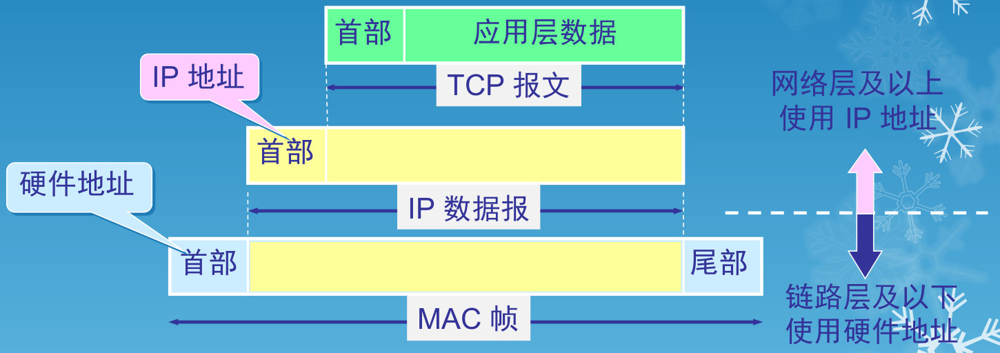

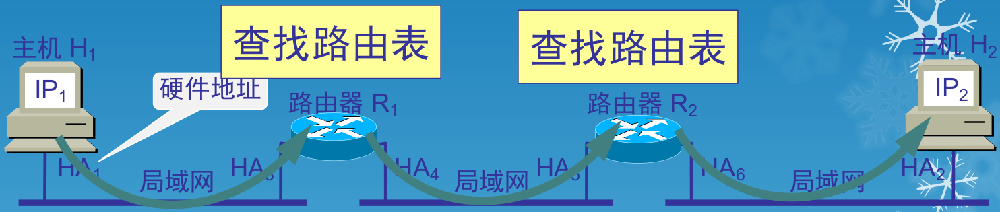

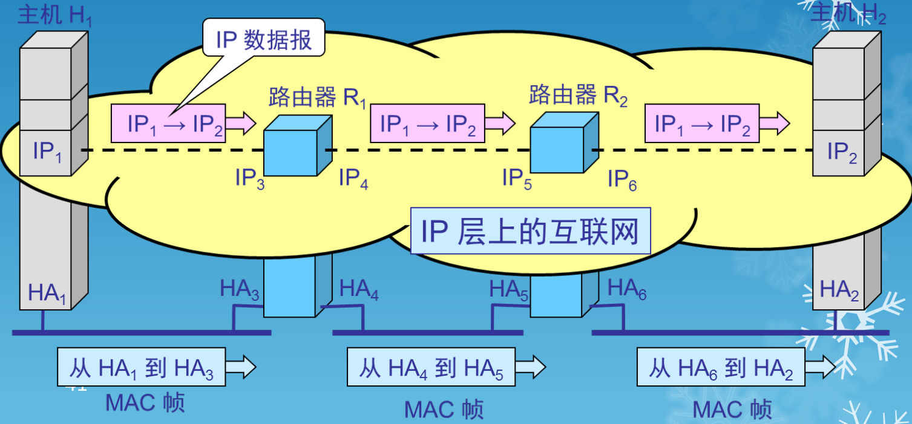

- 在 IP 层抽象的互联网上只能看到 IP 数据报。图中 IP$_1\rarr$ IP$_2$ 表示从源地址 IP$_1$ 到目的地址 IP$_2$，两个路由器的 IP 地址并不出现在 IP 数据报的首部中
- 路由器只根据目的站的 IP 地址的网络号进行路由选择
- 在具体的物理网络的链路层只能看见 MAC 帧而看不见 IP 数据报
- IP 层抽象的互联网屏蔽了下层很复杂的细节，在抽象的网络层上讨论问题，就能够使用统一的、抽象的 IP 地址研究主机和主机或主机和路由器之间的通信

### 地址解析协议 ARP 和逆地址解析协议 RARP

- 地址解析协议(ARP, Address Resolution Protocol)
- 逆地址解析协议(RARP, Reverse Address Resolution Protocol)

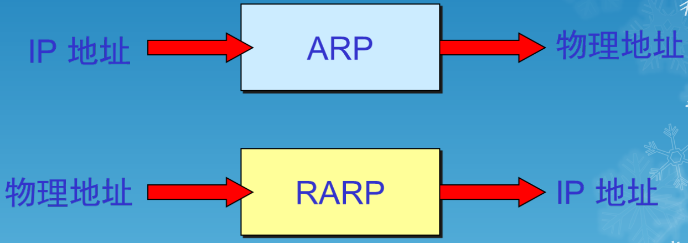

### 地址解析协议 ARP

- 不管网络层使用的是什么协议，在实际网络的链路上传送数据帧时，最终还是必须使用硬件地址
- 每一个主机都设有一个ARP 高速缓存(ARP cache)，里面有所在的局域网上的各主机和路由器的IP地址到硬件地址的映射表
- 当主机 A 欲向本局域网上的某个主机 B 发送 IP 数据报时，就先在其 ARP 高速缓存中查看有无主机 B 的 IP 地址。如有，就可查出其对应的硬件地址，再将此硬件地址写入 MAC 帧，然后通过局域网将该 MAC 帧发往此硬件地址

### ARP高速缓存的作用

- 为了减少网络上的通信量，主机 A 在发送其 ARP 请求分组时，就将自己的 IP 地址到硬件地址的映射写入 ARP 请求分组
- 当主机 B 收到 A 的 ARP 请求分组时，就将主机 A 的这一地址映射写入主机 B 自己的 ARP 高速缓存中。这对主机 B 以后向 A 发送数据报时就更方便了

> 注意：
>
> - ARP 是解决同一个局域网上的主机或路由器的 IP 地址和硬件地址的映射问题
> - 如果所要找的主机和源主机不在同一个局域网上，那么就要通过 ARP 找到一个位于本局域网上的某个路由器的硬件地址，然后把分组发送给这个路由器，让这个路由器把分组转发给下一个网络。剩下的工作就由下一个网络来做
> - 从 IP 地址到硬件地址的解析是自动进行的，主机的用户对这种地址解析过程是不知道的
> - 只要主机或路由器要和本网络上的另一个已知 IP 地址的主机或路由器进行通信，ARP 协议就会自动地将该 IP 地址解析为链路层所需要的硬件地址

### 使用 ARP 的四种典型情况

- 发送方是主机，要把 IP 数据报发送到本网络上的另一个主机。这时用 ARP 找到目的主机的硬件地址
- 发送方是主机，要把 IP 数据报发送到另一个网络上的一个主机。这时用 ARP 找到本网络上的一个路由器的硬件地址。剩下的工作由这个路由器来完成
- 发送方是路由器，要把 IP 数据报转发到本网络上的一个主机。这时用 ARP 找到目的主机的硬件地址
- 发送方是路由器，要把 IP 数据报转发到另一个网络上的一个主机。这时用 ARP 找到本网络上的一个路由器的硬件地址。剩下的工作由这个路由器来完成

### 不直接使用硬件地址进行通信的原因

- 由于全世界存在着各式各样的网络，它们使用不同的硬件地址。要使这些异构网络能够互相通信就必须进行非常复杂的硬件地址转换工作，因此几乎是不可能的事
- 连接到因特网的主机都拥有统一的 IP 地址，它们之间的通信就像连接在同一个网络上那样简单方便，因为调用 ARP 来寻找某个路由器或主机的硬件地址都是由计算机软件自动进行的，对用户来说是看不见这种调用过程的

### IP 数据报的格式

- 一个 IP 数据报由首部和数据两部分组成
- 首部的前一部分是固定长度，共20字节，是所有IP数据报必须具有的
- 在首部的固定部分的后面是一些可选字段，其长度是可变的

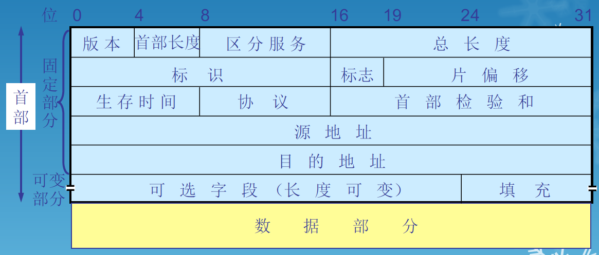

- 版本占4 位，指IP 协议的版本，目前的IP 协议版本号为4 (即IPv4)
- 首部长度占4位，可表示的最大数值是15 个单位(一个单位为 4 字节)，因此 IP 的首部长度的最大值是 60 字节
- 区分服务占8位，用来获得更好的服务。在旧标准中叫做服务类型，但实际上一直未被使用过，1998年这个字段改名为区分服务。只有在使用区分服务(DiffServ)时，这个字段才起作用。在一般的情况下都不使用这个字段
- 总长度占16 位，指首部和数据之和的长度，单位为字节，因此数据报的最大长度为65535 字节。总长度必须不超过最大传送单元MTU
- 标识(identification) 占16 位，它是一个计数器，用来产生数据报的标识
- 标志(flag)占 3 位,目前只有前两位有意义
  - 标志字段的最低位是 MF (More Fragment)
  - MF = 1 表示后面“还有分片”。MF = 0 表示最后一个分片
  - 标志字段中间的一位是 DF (Don't Fragment) 
  - 只有当 DF = 0 时才允许分片
- 片偏移(13 位)指出较长的分组在分片后某片在原分组中的相对位置
  - 片偏移以 8 个字节为偏移单位

### IP 层转发分组的流程

- 有四个A 类网络通过三个路由器连接在一起。每一个网络上都可能有成千上万个主机
- 若按目的主机号来制作路由表，则所得出的路由表就会过于庞大
- 但若按主机所在的网络地址来制作路由表，那么每一个路由器中的路由表就只包含4 个项目。这样就可使路由表大大简化

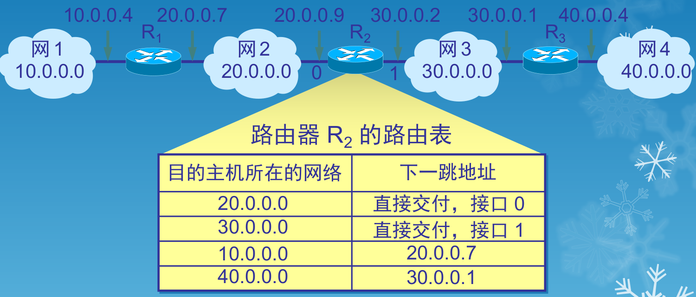

- 在路由表中，对每一条路由，最主要的是(目的网络地址，下一跳地址)

### 查找路由表

- 根据目的网络地址就能确定下一跳路由器，这样做的结果是：
  - IP 数据报最终一定可以找到目的主机所在目的网络上的路由器（可能要通过多次的间接交付）
  - 只有到达最后一个路由器时，才试图向目的主机进行直接交付

### 默认路由(default route)

- 路由器还可采用默认路由以减少路由表所占用的空间和搜索路由表所用的时间
- 这种转发方式在一个网络只有很少的对外连接时是很有用的
- 默认路由在主机发送IP 数据报时往往更能显示出它的好处
- 如果一个主机连接在一个小网络上，而这个网络只用一个路由器和因特网连接，那么在这种情况下使用默认路由是非常合适的

> 注意：
>
> - IP 数据报的首部中没有地方可以用来指明“下一跳路由器的 IP 地址”
> - 当路由器收到待转发的数据报,不是将下一跳路由器的 IP 地址填入 IP 数据报,而是送交下层的网络接口软件
> - 网络接口软件使用 ARP 负责将下一跳路由器的 IP 地址转换成硬件地址,并将此硬件地址放在链路层的 MAC 帧的首部,然后根据这个硬件地址找到下一跳路由器

### 分组转发算法

1. 从数据报的首部提取目的主机的 IP 地址 D, 得出目的网络地址为 N
2. 若网络 N 与此路由器直接相连,则把数据报直接交付目的主机 D;否则是间接交付,执行3
3. 若路由表中有目的地址为 D 的特定主机路由,则把数据报传送给路由表中所指明的下一跳路由器;否则,执行4
4. 若路由表中有到达网络 N 的路由,则把数据报传送给路由表指明的下一跳路由器;否则,执行5
5. 若路由表中有一个默认路由,则把数据报传送给路由表中所指明的默认路由器;否则,执行6
6. 报告转发分组出错

---

## 划分子网

### 从二级IP地址到三级IP地址

- 在ARPANET 的早期，IP地址的设计确实不够合理
  - IP 地址空间的利用率有时很低
  - 给每一个物理网络分配一个网络号会使路由表变得太大因而使网络性能变坏
  - 两级的IP 地址不够灵活。
- 从1985 年起在IP 地址中又增加了一个“子网号字段”，使两级的IP 地址变成为三级的IP 地址
- 这种做法叫作划分子网(subnetting) 。划分子网已成为因特网的正式标准协议

### 基本思路

- 划分子网纯属一个单位内部的事情。单位对外仍然表现为没有划分子网的网络

- 从主机号借用若干个位作为子网号subnet-id，而主机号host-id 也就相应减少了若干个位

  

- 凡是从其他网络发送给本单位某个主机的IP数据报，仍然是根据IP数据报的目的网络号net-id，先找到连接在本单位网络上的路由器

- 然后此路由器在收到IP数据报后，再按目的网络号net-id和子网号subnet-id找到目的子网

- 最后就将IP数据报直接交付目的主机

### 三级结构

- 当没有划分子网时,IP 地址是两级结构
- 划分子网后 IP 地址就变成了三级结构
- 划分子网只是把 IP 地址的主机号 host-id 这部分进行再划分,而不改变 IP 地址原来的网络号 net-id

### 子网掩码

- 从一个 IP 数据报的首部并无法判断源主机或目的主机所连接的网络是否进行了子网划分
- 使用子网掩码(subnet mask)可以找出 IP 地址中的子网部分

### IP 地址的各字段和子网掩码

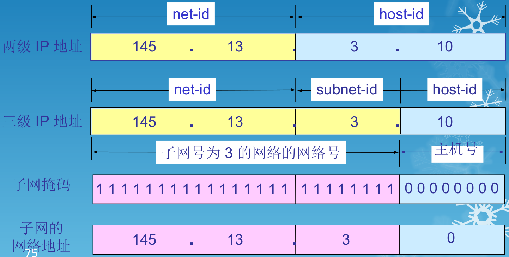

- IP 地址 AND 子网掩码 = 网络地址

### 默认子网掩码

| 网络类别 | 默认子网掩码  |
| :------: | :-----------: |
| A类地址  |   255.0.0.0   |
| B类地址  |  255.255.0.0  |
| C类地址  | 255.255.255.0 |

### 子网掩码是一个重要属性

- 子网掩码是一个网络或一个子网的重要属性
- 路由器在和相邻路由器交换路由信息时,必须把自己所在网络(或子网)的子网掩码告诉相邻路由器
- 路由器的路由表中的每一个项目,除了要给出目的网络地址外,还必须同时给出该网络的子网掩码
- 若一个路由器连接在两个子网上就拥有两个网络地址和两个子网掩码

### 使用子网掩码的分组转发过程

- 在不划分子网的两级 IP 地址下,从 IP 地址得出网络地址是个很简单的事
- 但在划分子网的情况下,从 IP 地址却不能唯一地得出网络地址来,这是因为网络地址取决于那个网络所采用的子网掩码,但数据报的首部并没有提供子网掩码的信息
- 因此分组转发的算法也必须做相应的改动

### 划分子网情况下路由器转发分组的算法

1. 从收到的分组的首部提取目的 IP 地址 D
2. 先用各网络的子网掩码和 D 逐位相“与”,看是否和相应的网络地址匹配。若匹配,则将分组直接交付。否则就是间接交付,执行3
3. 若路由表中有目的地址为 D 的特定主机路由,则将分组传送给指明的下一跳路由器;否则,执行4
4. 对路由表中的每一行的子网掩码和 D 逐位相“与”,若其结果与该行的目的网络地址匹配,则将分组传送给该行指明的下一跳路由器;否则,执行5
5. 若路由表中有一个默认路由,则将分组传送给路由表中所指明的默认路由器;否则,执行6
6. 报告转发分组出错

---

## 构造超网

### 网络前缀

- 划分子网在一定程度上缓解了因特网在发展中遇到的困难。然而在 1992 年因特网仍然面临三个必须尽早解决的问题
  - B 类地址在 1992 年已分配了近一半,在 1994年 3 月全部分配完毕
  - 因特网主干网上的路由表中的项目数急剧增长(从几千个增长到几万个)
  - 整个 IPv4 的地址空间最终将全部耗尽

### IP 编址问题的演进

- 1987 年,RFC 1009 就指明了在一个划分子网的网络中可同时使用几个不同的子网掩码。使用变长子网掩码(VLSM, Variable Length Subnet Mask)可进一步提高 IP 地址资源的利用率
- 在 VLSM 的基础上又进一步研究出无分类编址方法,它的正式名字是无分类域间路由选择(CIDR, Classless Inter-Domain Routing)

### CIDR 最主要的特点

- CIDR 消除了传统的 A 类、B 类和 C 类地址以及划分子网的概念,因而可以更加有效地分配 IPv4的地址空间
- CIDR 使用各种长度的“网络前缀”(network-prefix)来代替分类地址中的网络号和子网号
- IP 地址从三级编址(使用子网掩码)又回到了两级编址

### 无分类的两级编址

- 无分类的两级编址的记法

- CIDR 还使用“斜线记法”(slash notation),它又称为CIDR记法,即在 IP 地址后面加上一个斜线“/”,然后写上网络前缀所占的位数(这个数值对应于三级编址中子网掩码中 1 的个数)
- CIDR 把网络前缀都相同的连续的 IP 地址组成“CIDR 地址块”

### CIDR 地址块

- 128.14.32.0/20 表示的地址块共有 $2^{12}$ 个地址(因为斜线后面的20是网络前缀的位数,所以这个地址的主机号是12位)
- 这个地址块的起始地址是 128.14.32.0
- 在不需要指出地址块的起始地址时,也可将这样的地址块简称为“/20 地址块”
- 128.14.32.0/20地址块的最小地址为128.14.32.0
- 128.14.32.0/20地址块的最大地址为128.14.47.255
- 全 0 和全 1 的主机号地址一般不使用

### CIDR 记法的其他形式

- 10.0.0.0/10可简写为10/10，也就是把点十进制中低位连续的0省略
- 10.0.0.0/10隐含指出 IP 地址10.0.0.0的掩码是255.192.0.0

### 最长前缀匹配

- 使用 CIDR 时,路由表中的每个项目由“网络前缀”和“下一跳地址”组成。在查找路由表时可能会得到不止一个匹配结果
- 应当从匹配结果中选择具有最长网络前缀的路由:最长前缀匹配(longest-prefix matching)
- 网络前缀越长,其地址块就越小,因而路由就越具体(more specific) 
- 最长前缀匹配又称为最长匹配或最佳匹配

---

## 网际控制报文协议 ICMP

- 为了提高 IP 数据报交付成功的机会,在网际层使用了网际控制报文协议 ICMP (Internet Control Message Protocol)
- ICMP 允许主机或路由器报告差错情况和提供有关异常情况的报告
- ICMP 不是高层协议,而是 IP 层的协议
- ICMP 报文作为 IP 层数据报的数据,加上数据报的首部,组成 IP 数据报发送出去

### ICMP 报文的种类

- ICMP 报文的种类有两种,即 ICMP 差错报告报文和 ICMP 询问报文
- ICMP 报文的前 4 个字节是统一的格式,共有三个字段：即类型、代码和检验和。接着的 4 个字节的内容与 ICMP 的类型有关

### ICMP 差错报告报文

- 终点不可达
- 源点抑制(Source quench)
- 时间超过
- 参数问题
- 改变路由(重定向)(Redirect)

### 不应发送 ICMP 差错报告报文的情况

- 对 ICMP 差错报告报文不再发送 ICMP 差错报告报文
- 对第一个分片的数据报片的所有后续数据报片都不发送 ICMP 差错报告报文
- 对具有多播地址的数据报都不发送 ICMP 差错报告报文
- 对具有特殊地址(如127.0.0.0 或 0.0.0.0)的数据报不发送 ICMP 差错报告报文

### ICMP 询问报文

- 回送请求和回答报文
- 时间戳请求和回答报文
- 下面的几种 ICMP 报文不再使用：
  - 信息请求与回答报文
  - 掩码地址请求和回答报文
  - 路由器询问和通告报文

---

## 路由选择协议

### 基本概念

- 理想的路由算法需满足的条件：
  - 算法必须是正确的和完整的
  - 算法在计算上应简单
  - 算法应能适应通信量和网络拓扑的变化,这就是说,要有自适应性
  - 算法应具有稳定性
  - 算法应是公平的
  - 算法应是最佳的
- 分层次的路由选择协议
  - 因特网采用分层次的路由选择协议
  - 因特网的规模非常大。如果让所有的路由器知道所有的网络应怎样到达,则这种路由表将非常大,处理起来也太花时间。而所有这些路由器之间交换路由信息所需的带宽就会使因特网的通信链路饱和
  - 许多单位不愿意外界了解自己单位网络的布局细节和本部门所采用的路由选择协议(这属于本部门内部的事情),但同时还希望连接到因特网上

### 最佳路由

- 不存在一种绝对的最佳路由算法
- 所谓“最佳”只能是相对于某一种特定要求下得出的较为合理的选择而已
- 实际的路由选择算法,应尽可能接近于理想的算法
- 路由选择是个非常复杂的问题
  - 它是网络中的所有结点共同协调工作的结果
  - 路由选择的环境往往是不断变化的,而这种变化有时无法事先知道

### 路由选择

- 静态路由选择策略——即非自适应路由选择,其特点是简单和开销较小,但不能及时适应网络状态的变化
- 动态路由选择策略——即自适应路由选择,其特点是能较好地适应网络状态的变化,但实现起来较为复杂,开销也比较大

### 两大类路由选择协议

- 内部网关协议(IGP, Interior Gateway Protocol)即在一个自治系统内部使用的路由选择协议。目前这类路由选择协议使用得最多, 如 RIP 和 OSPF 协议
- 外部网关协议(EGP, External Gateway Protocol)若源站和目的站处在不同的自治系统中,当数据报传到一个自治系统的边界时,就需要使用一种协议将路由选择信息传递到另一个自治系统中。这样的协议就是外部网关协议 EGP。在外部网关协议中目前使用最多的是 BGP-4

### 路由信息协议 RIP

- 路由信息协议(RIP, Routing Information Protocol)是内部网关协议 IGP 中最先得到广泛使用的协议
- RIP 是一种分布式的基于距离向量的路由选择协议
- RIP 协议要求网络中的每一个路由器都要维护从它自己到其他每一个目的网络的距离记录

### “距离”的定义

- 从一路由器到直接连接的网络的距离定义为 1
- 从一个路由器到非直接连接的网络的距离定义为所经过的路由器数加 1
- RIP 协议中的“距离”也称为“跳数”(hop count),因为每经过一个路由器,跳数就加 1
- 这里的“距离”实际上指的是“最短距离”
- RIP 认为一个好的路由就是它通过的路由器的数目少,即“距离短”
- RIP 允许一条路径最多只能包含 15 个路由器
- “距离”的最大值为16 时即相当于不可达。可见 RIP 只适用于小型互联网
- RIP 不能在两个网络之间同时使用多条路由。RIP 选择一个具有最少路由器的路由(即最短路由),哪怕还存在另一条高速(低时延)但路由器较多的路由

### RIP 协议的三个要点

- 仅和相邻路由器交换信息
- 交换的信息是当前本路由器所知道的全部信息,即自己的路由表
- 按固定的时间间隔交换路由信息,例如,每隔 30 秒

### 路由表的建立

- 路由器在刚刚开始工作时,只知道到直接连接的网络的距离(此距离定义为1)
- 以后,每一个路由器也只和数目非常有限的相邻路由器交换并更新路由信息
- 经过若干次更新后,所有的路由器最终都会知道到达本自治系统中任何一个网络的最短距离和下一跳路由器的地址
- RIP 协议的收敛(convergence)过程较快,即在自治系统中所有的结点都得到正确的路由选择信息的过程

### 路由器之间交换信息

- RIP协议让互联网中的所有路由器都和自己的相邻路由器不断交换路由信息,并不断更新其路由表,使得从每一个路由器到每一个目的网络的路由都是最短的(即跳数最少)
- 虽然所有的路由器最终都拥有了整个自治系统的全局路由信息,但由于每一个路由器的位置不同,它们的路由表当然也应当是不同的

### RIP2 协议的报文格式

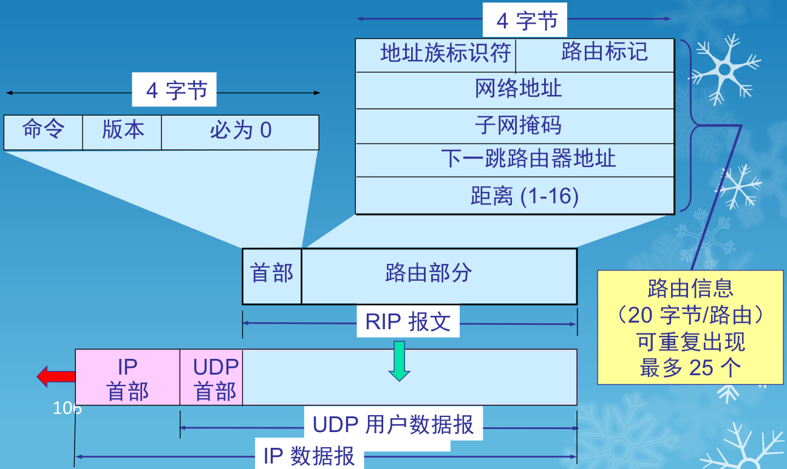

### RIP 协议的优缺点

- RIP 存在的一个问题是当网络出现故障时,要经过比较长的时间才能将此信息传送到所有的路由器，即好消息传播地快，坏消息传播地慢
- RIP 协议最大的优点就是实现简单,开销较小
- RIP 限制了网络的规模,它能使用的最大距离为15(16 表示不可达)
- 路由器之间交换的路由信息是路由器中的完整路由表,因而随着网络规模的扩大,开销也就增加

### 路由器的结构

- 路由器是一种具有多个输入端口和多个输出端口的专用计算机,其任务是转发分组。也就是说,将路由器某个输入端口收到的分组,按照分组要去的目的地(即目的网络),把该分组从路由器的某个合适的输出端口转发给下一跳路由器
- 下一跳路由器也按照这种方法处理分组,直到该分组到达终点为止

### “转发”和“路由选择”的区别

- 转发”(forwarding)就是路由器根据转发表将用户的 IP 数据报从合适的端口转发出去
- “路由选择”(routing)则是按照分布式算法,根据从各相邻路由器得到的关于网络拓扑的变化情况,动态地改变所选择的路由
- 路由表是根据路由选择算法得出的。而转发表是从路由表得出的
- 在讨论路由选择的原理时,往往不去区分转发表和路由表的区别

### 输入端口对线路上收到的分组的处理

- 数据链路层剥去帧首部和尾部后,将分组送到网络层的队列中排队等待处理。这会产生一定的时延

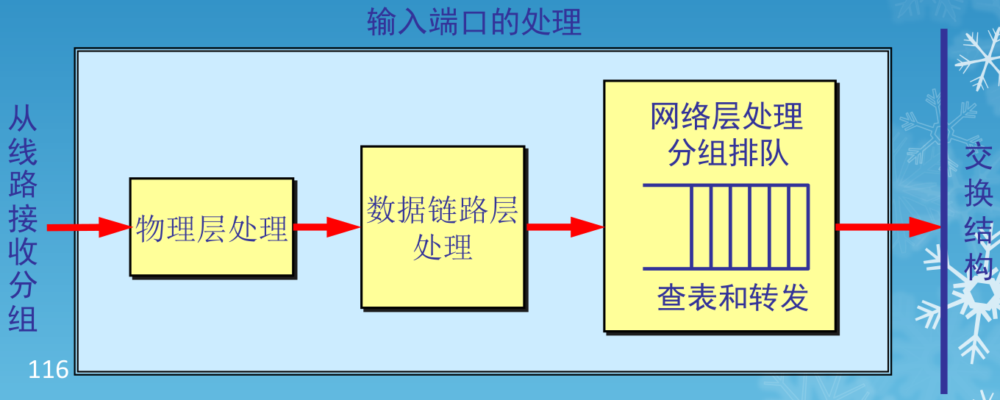

### 输出端口将交换结构传送来的分组发送到线路

- 当交换结构传送过来的分组先进行缓存。数据链路层处理模块将分组加上链路层的首部和尾部,交给物理层后发送到外部线路

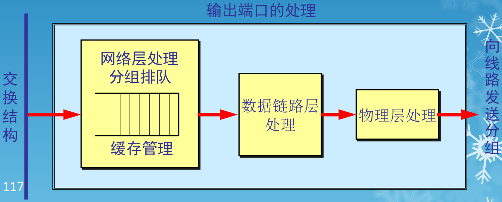

### 分组丢弃

- 若路由器处理分组的速率赶不上分组进入队列的速率,则队列的存储空间最终必定减少到零,这就使后面再进入队列的分组由于没有存储空间而只能被丢弃
- 路由器中的输入或输出队列产生溢出是造成分组丢失的重要原因