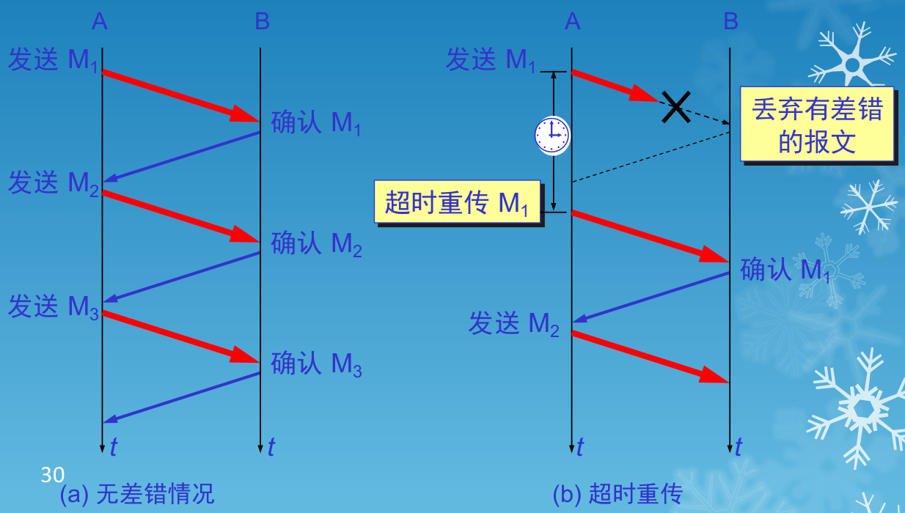

# WEEK 5

## 运输层协议

### 进程之间的通信

- 从通信和信息处理的角度看,运输层向它上面的应用层提供通信服务,它属于面向通信部分的最高层,同时也是用户功能中的最低层
- 当网络的边缘部分中的两个主机使用网络的核心部分的功能进行端到端的通信时,只有位于网络边缘部分的主机的协议栈才有运输层,而网络核心部分中的路由器在转发分组时都只用到下三层的功能

### 运输层为相互通信的应用进程提供了逻辑通信

### 应用进程之间的通信

- 两个主机进行通信实际上就是两个主机中的应用进程互相通信
- 应用进程之间的通信又称为端到端的通信
- 运输层的一个很重要的功能就是复用和分用。应用层不同进程的报文通过不同的端口向下交到运输层,再往下就共用网络层提供的服务
- “运输层提供应用进程间的逻辑通信”。“逻辑通信”的意思是:运输层之间的通信好像是沿水平方向传送数据。但事实上这两个运输层之间并没有一条水平方向的物理连接

### 运输层协议和网络层协议的主要区别

### 运输层的主要功能

- 运输层为应用进程之间提供端到端的逻辑通信(但网络层是为主机之间提供逻辑通信)
- 运输层还要对收到的报文进行差错检测
- 运输层需要有两种不同的运输协议,即面向连接的 TCP 和无连接的 UDP

### 两种不同的运输协议

- 运输层向高层用户屏蔽了下面网络核心的细节(如网络拓扑、所采用的路由选择协议等),它使应用进程看见的就是好像在两个运输层实体之间有一条端到端的逻辑通信信道
- 当运输层采用面向连接的 TCP 协议时,尽管下面的网络是不可靠的(只提供尽最大努力服务),但这种逻辑通信信道就相当于一条全双工的可靠信道
- 当运输层采用无连接的 UDP 协议时,这种逻辑通信信道是一条不可靠信道

### TCP与UDP

- 用户数据报协议UDP(User Datagram Protocol)
- 传输控制协议TCP(Transmission Control Protocol)
- 两个对等运输实体在通信时传送的数据单位叫作运输协议数据单元 TPDU (Transport Protocol Data Unit)
- TCP 传送的数据单位协议是 TCP 报文段(segment)
- UDP 传送的数据单位协议是 UDP 报文或用户数据报
- UDP 在传送数据之前不需要先建立连接。对方的运输层在收到 UDP 报文后,不需要给出任何确认。虽然 UDP 不提供可靠交付,但在某些情况下 UDP 是一种最有效的工作方式。
- TCP 则提供面向连接的服务。TCP 不提供广播或多播服务。由于 TCP 要提供可靠的、面向连接的运输服务,因此不可避免地增加了许多的开销。这不仅使协议数据单元的首部增大很多,还要占用许多的处理机资源
- 开发软件时若追求速度和实时性则使用UDP协议，若追求准确则使用TCP协议

### 运输层的端口

- 运行在计算机中的进程是用进程标识符来标志的
- 运行在应用层的各种应用进程却不应当让计算机操作系统指派它的进程标识符。这是因为在因特网上使用的计算机的操作系统种类很多,而不同的操作系统又使用不同格式的进程标识符
- 为了使运行不同操作系统的计算机的应用进程能够互相通信,就必须用统一的方法对 TCP/IP 体系的应用进程进行标志

### 需要解决的问题

- 由于进程的创建和撤销都是动态的,发送方几乎无法识别其他机器上的进程
- 有时我们会改换接收报文的进程,但并不需要通知所有发送方
- 我们往往需要利用目的主机提供的功能来识别终点,而不需要知道实现这个功能的进程

### 端口号(protocol port number)

- 简称为端口(port)
- 解决上述问题的方法就是在运输层使用协议端口号(protocol port number),或通常简称为端口(port)
- 虽然通信的终点是应用进程,但我们可以把端口想象是通信的终点,因为我们只要把要传送的报文交到目的主机的某一个合适的目的端口,剩下的工作(即最后交付目的进程)就由 TCP 来完成

### 软件端口与硬件端口

- 在协议栈层间的抽象的协议端口是软件端口
- 路由器或交换机上的端口是硬件端口
- 硬件端口是不同硬件设备进行交互的接口,而软件端口是应用层的各种协议进程与运输实体进行层间交互的一种地址

### TCP 的端口

- 端口用一个 16 位端口号进行标志
- 端口号只具有本地意义,即端口号只是为了标志本计算机应用层中的各进程。在因特网中不同计算机的相同端口号是没有联系的

### 三类端口

- 熟知端口,数值一般为 0~1023
- 登记端口号,数值为1024~49151,为没有熟知端口号的应用程序使用的。使用这个范围的端口号必须在 IANA 登记,以防止重复
- 客户端口号或短暂端口号,数值为49152~65535,留给客户进程选择暂时使用。当服务器进程收到客户进程的报文时,就知道了客户进程所使用的动态端口号。通信结束后,这个端口号可供其他客户进程以后使用

---

## 用户数据报协议 UDP

- UDP 只在 IP 的数据报服务之上增加了很少一点的功能,即端口的功能和差错检测的功能
- 虽然 UDP 用户数据报只能提供不可靠的交付,但 UDP 在某些方面有其特殊的优点

### UDP 的主要特点

- UDP 是无连接的,即发送数据之前不需要建立连接
- UDP 使用尽最大努力交付,即不保证可靠交付,同时也不使用拥塞控制
- UDP 是面向报文的。UDP 没有拥塞控制,很适合多媒体通信的要求
- UDP 支持一对一、一对多、多对一和多对多的交互通信
- UDP 的首部开销小,只有 8 个字节

### 面向报文的 UDP

- 发送方 UDP 对应用程序交下来的报文,在添加首部后就向下交付 IP 层。UDP 对应用层交下来的报文,既不合并,也不拆分,而是保留这些报文的边界
- 应用层交给 UDP 多长的报文,UDP 就照样发送,即一次发送一个报文
- 接收方 UDP 对 IP 层交上来的 UDP 用户数据报,在去除首部后就原封不动地交付上层的应用进程,一次交付一个完整的报文
- 应用程序必须选择合适大小的报文

### UDP 的首部格式

---

## 传输控制协议TCP

### TCP的主要特点

- TCP 是面向连接的运输层协议

- 每一条 TCP 连接只能有两个端点(endpoint),每一条 TCP 连接只能是点对点的(一对一)

- TCP 提供可靠交付的服务

- TCP 提供全双工通信

- 面向字节流

  

> 注意：
>
> - TCP 连接是一条虚连接而不是一条真正的物理连接
> - TCP 对应用进程一次把多长的报文发送到TCP 的缓存中是不关心的
> - TCP 根据对方给出的窗口值和当前网络拥塞的程度来决定一个报文段应包含多少个字节(UDP 发送的报文长度是应用进程给出的)
> - TCP 可把太长的数据块划分短一些再传送。TCP也可等待积累有足够多的字节后再构成报文段发送出去

### TCP的连接

- TCP 把连接作为最基本的抽象
- 每一条 TCP 连接有两个端点
- TCP 连接的端点不是主机,不是主机的IP 地址,不是应用进程,也不是运输层的协议端口。TCP连接的端点叫做套接字(socket)或插口
- 端口号拼接到(concatenated with) IP 地址即构成了套接字

### 套接字(socket)

- 每一条 TCP 连接唯一地被通信两端的两个端点(即两个套接字)所确定

  

---

## 可靠传输的工作原理

### 停止等待协议

> 注意：
>
> - 在发送完一个分组后,必须暂时保留已发送的分组的副本
> - 分组和确认分组都必须进行编号
> - 超时计时器的重传时间应当比数据在分组传输的平均往返时间更长一些

### 确认丢失和确认迟到

### 可靠通信的实现

- 使用上述的确认和重传机制,我们就可以在不可靠的传输网络上实现可靠的通信
- 这种可靠传输协议常称为自动重传请求ARQ(Automatic Repeat reQuest)
- ARQ 表明重传的请求是自动进行的。接收方不需要请求发送方重传某个出错的分组

### 信道利用率

- 停止等待协议的优点是简单,但缺点是信道利用率太低

  

$$
U=\frac{T_D}{T_D+RTT+T_A}
$$

### 流水线传输

- 发送方可连续发送多个分组,不必每发完一个分组就停顿下来等待对方的确认
- 由于信道上一直有数据不间断地传送,这种传输方式可获得很高的信道利用率

### 连续 ARQ 协议

### 累积确认

- 接收方一般采用累积确认的方式。即不必对收到的分组逐个发送确认,而是对按序到达的最后一个分组发送确认,这样就表示:到这个分组为止的所有分组都已正确收到了
- 累积确认的优点是容易实现,即使确认丢失也不必重传。缺点是不能向发送方反映出接收方已经正确收到的所有分组的信息

### Go-back-N(回退 N)

- 如果发送方发送了前 5 个分组,而中间的第 3 个分组丢失了。这时接收方只能对前两个分组发出确认。发送方无法知道后面三个分组的下落,而只好把后面的三个分组都再重传一次
- 这就叫做 Go-back-N(回退 N),表示需要再退回来重传已发送过的 N 个分组
- 可见当通信线路质量不好时,连续 ARQ 协议会带来负面的影响

### TCP 可靠通信的具体实现

- TCP 连接的每一端都必须设有两个窗口——一个发送窗口和一个接收窗口
- TCP 的可靠传输机制用字节的序号进行控制。TCP所有的确认都是基于序号而不是基于报文段
- TCP 两端的四个窗口经常处于动态变化之中
- TCP连接的往返时间 RTT 也不是固定不变的。需要使用特定的算法估算较为合理的重传时间

### TCP 报文段的首部格式

- 源端口和目的端口字段——各占 2 字节。端口是运输层与应用层的服务接口。运输层的复用和分用功能都要通过端口才能实现

- 序号字段——占 4 字节。TCP 连接中传送的数据流中的每一个字节都编上一个序号。序号字段的值则指的是本报文段所发送的数据的第一个字节的序号
- 确认号字段——占 4 字节,是期望收到对方的下一个报文段的数据的第一个字节的序号
- 数据偏移(即首部长度)——占 4 位,它指出 TCP 报文段的数据起始处距离 TCP 报文段的起始处有多远。“数据偏移”的单位是32 位字(以 4 字节为计算单位)
- 保留字段——占 6 位,保留为今后使用,但目前应置为 0
- 紧急 URG —— 当 URG = 1 时,表明紧急指针字段有效。它告诉系统此报文段中有紧急数据,应尽快传送(相当于高优先级的数据)
- 确认 ACK —— 只有当 ACK = 1 时确认号字段才有效。当ACK = 0 时,确认号无效
- 推送 PSH (PUSH) —— 接收 TCP 收到 PSH = 1 的报文段,就尽快地交付接收应用进程,而不再等到整个缓存都填满了后再向上交付
- 复位 RST (ReSeT) —— 当 RST = 1 时,表明 TCP 连接中出现严重差错(如由于主机崩溃或其他原因),必须释放连接,然后再重新建立运输连接
- 同步 SYN —— 同步 SYN = 1 表示这是一个连接请求或连接接受报文
- 终止 FIN (FINish) —— 用来释放一个连接。FIN = 1 表明此报文段的发送端的数据已发送完毕,并要求释放运输连接
- 窗口字段 —— 占 2 字节,用来让对方设置发送窗口的依据，单位为字节
- 检验和 —— 占 2 字节。检验和字段检验的范围包括首部和数据这两部分。在计算检验和时,要在TCP 报文段的前面加上 12 字节的伪首部
- 紧急指针字段 —— 占 16 位,指出在本报文段中紧急数据共有多少个字节(紧急数据放在本报文段数据的最前面)
- 选项字段 —— 长度可变。TCP 最初只规定了一种选项,即最大报文段长度 MSS。其它选项包括窗口扩大选项、时间戳选项和选择确认选项
- 填充字段 —— 这是为了使整个首部长度是 4 字节的整数倍

### 以字节为单位的滑动窗口

### 发送缓存

### 接收缓存

### 发送缓存与接收缓存的作用

- 发送缓存用来暂时存放:
  - 发送应用程序传送给发送方 TCP 准备发送的数据
  - TCP 已发送出但尚未收到确认的数据
- 接收缓存用来暂时存放:
  - 按序到达的、但尚未被接收应用程序读取的数据
  - 不按序到达的数据

> 注意：
>
> - A 的发送窗口并不总是和 B 的接收窗口一样大(因为有一定的时间滞后)
> - TCP 标准没有规定对不按序到达的数据应如何处理。通常是先临时存放在接收窗口中,等到字节流中所缺少的字节收到后,再按序交付上层的应用进程
> - TCP 要求接收方必须有累积确认的功能,这样可以减小传输开销

### 超时重传时间的选择

- 重传机制是 TCP 中最重要和最复杂的问题之一
- TCP 每发送一个报文段,就对这个报文段设置一次计时器。只要计时器设置的重传时间到但还没有收到确认,就要重传这一报文段

---

## TCP 的流量控制与拥塞控制

### 利用滑动窗口实现流量控制

- 一般说来,我们总是希望数据传输得更快一些。但如果发送方把数据发送得过快,接收方就可能来不及接收,这就会造成数据的丢失
- 流量控制(flow control)就是让发送方的发送速率不要太快,既要让接收方来得及接收,也不要使网络发生拥塞
- 利用滑动窗口机制可以很方便地在 TCP 连接上实现流量控制

### 持续计时器(persistence timer)

- TCP 为每一个连接设有一个持续计时器
- 只要 TCP 连接的一方收到对方的零窗口通知,就启动持续计时器
- 若持续计时器设置的时间到期,就发送一个零窗口探测报文段(仅携带 1 字节的数据),而对方就在确认这个探测报文段时给出了现在的窗口值
- 若窗口仍然是零,则收到这个报文段的一方就重新设置持续计时器
- 若窗口不是零,则死锁的僵局就可以打破了

### 拥塞控制

- 在某段时间,若对网络中某资源的需求超过了该资源所能提供的可用部分,网络的性能就要变坏——产生拥塞(congestion)
- 出现资源拥塞的条件：对资源需求的总和 > 可用资源
- 若网络中有许多资源同时产生拥塞,网络的性能就要明显变坏,整个网络的吞吐量将随输入负荷的增大而下降

### 拥塞控制与流量控制的关系

- 拥塞控制所要做的都有一个前提,就是网络能够承受现有的网络负荷
- 拥塞控制是一个全局性的过程,涉及到所有的主机、所有的路由器,以及与降低网络传输性能有关的所有因素
- 流量控制往往指在给定的发送端和接收端之间的点对点通信量的控制
- 流量控制所要做的就是抑制发送端发送数据的速率,以便使接收端来得及接收

### 拥塞控制的作用

### 拥塞控制的一般原理

- 拥塞控制是很难设计的,因为它是一个动态的(而不是静态的)问题
- 当前网络正朝着高速化的方向发展,这很容易出现缓存不够大而造成分组的丢失。但分组的丢失是网络发生拥塞的征兆而不是原因
- 在许多情况下,甚至正是拥塞控制本身成为引起网络性能恶化甚至发生死锁的原因。这点应特别引起重视

### 拥塞控制方法-慢开始和拥塞避免

- 发送方维持一个叫做拥塞窗口 cwnd(congestion window)的状态变量。拥塞窗口的大小取决于网络的拥塞程度,并且动态地在变化。发送方让自己的发送窗口等于拥塞窗口。如再考虑到接收方的接收能力,则发送窗口还可能小于拥塞窗口
- 发送方控制拥塞窗口的原则是只要网络没有出现拥塞,拥塞窗口就再增大一些,以便把更多的分组发送出去。但只要网络出现拥塞,拥塞窗口就减小一些,以减少注入到网络中的分组数

### 慢开始算法的原理

- 在主机刚刚开始发送报文段时可先设置拥塞窗口cwnd = 1,即设置为一个最大报文段 MSS 的数值
- 在每收到一个对新的报文段的确认后,将拥塞窗口加 1,即增加一个 MSS 的数值
- 用这样的方法逐步增大发送端的拥塞窗口 cwnd,可以使分组注入到网络的速率更加合理

### 传输轮次(transmission round)

- 使用慢开始算法后,每经过一个传输轮次,拥塞窗口 cwnd 就加倍
- 一个传输轮次所经历的时间其实就是往返时间RTT
- “传输轮次”更加强调:把拥塞窗口 cwnd 所允许发送的报文段都连续发送出去,并收到了对已发送的最后一个字节的确认
- 例如,拥塞窗口 cwnd = 4,这时的往返时间RTT 就是发送方连续发送 4 个报文段,并收到这 4 个报文段的确认,总共经历的时间

### 设置慢开始门限状态变量ssthresh

- 慢开始门限 ssthresh 的用法如下:
  - 当 cwnd < ssthresh 时,使用慢开始算法
  - 当 cwnd > ssthresh 时,停止使用慢开始算法而改用拥塞避免算法
  - 当 cwnd = ssthresh 时,既可使用慢开始算法,也可使用拥塞避免算法
  - 拥塞避免算法的思路是让拥塞窗口 cwnd 缓慢地增大,即每经过一个往返时间 RTT 就把发送方的拥塞窗口 cwnd 加 1,而不是加倍,使拥塞窗口 cwnd 按线性规律缓慢增长

### 网络拥塞时

- 无论在慢开始阶段还是在拥塞避免阶段,只要发送方判断网络出现拥塞(其根据就是没有按时收到确认),就要把慢开始门限 ssthresh 设置为出现拥塞时的发送方窗口值的一半(但不能小于2)
- 然后把拥塞窗口 cwnd 重新设置为 1,执行慢开始算法
- 这样做的目的就是要迅速减少主机发送到网络中的分组数,使得发生拥塞的路由器有足够时间把队列中积压的分组处理完毕

### 乘法减小(multiplicative decrease)与加法增大(additive increase)

- 乘法减小“是指不论在慢开始阶段还是拥塞避免阶段,只要出现一次超时(即出现一次网络拥塞),就把慢开始门限值 ssthresh 设置为当前的拥塞窗口值乘以 0.5
- 当网络频繁出现拥塞时,ssthresh 值就下降得很快,以大大减少注入到网络中的分组数
- “加法增大”是指执行拥塞避免算法后,在收到对所有报文段的确认后(即经过一个往返时间),就把拥塞窗口 cwnd增加一个 MSS 大小,使拥塞窗口缓慢增大,以防止网络过早出现拥塞

> 注意：
>
> - “拥塞避免”并非指完全能够避免了拥塞。利用以上的措施要完全避免网络拥塞还是不可能的
> - “拥塞避免”是说在拥塞避免阶段把拥塞窗口控制为按线性规律增长,使网络比较不容易出现拥塞

### 快重传

- 快重传算法首先要求接收方每收到一个失序的报文段后就立即发出重复确认。这样做可以让发送方及早知道有报文段没有到达接收方
- 发送方只要一连收到三个重复确认就应当立即重传对方尚未收到的报文段
- 不难看出,快重传并非取消重传计时器,而是在某些情况下可更早地重传丢失的报文段

### 快恢复

- 当发送端收到连续三个重复的确认时,就执行“乘法减小”算法,把慢开始门限 ssthresh 减半。但接下去不执行慢开始算法
- 由于发送方现在认为网络很可能没有发生拥塞,因此现在不执行慢开始算法,即拥塞窗口 cwnd现在不设置为 1,而是设置为慢开始门限ssthresh 减半后的数值,然后开始执行拥塞避免算法(“加法增大”),使拥塞窗口缓慢地线性增大

### 发送窗口的上限值

- 发送方的发送窗口的上限值应当取为接收方窗口 rwnd 和拥塞窗口 cwnd 这两个变量中较小的一个,即应按以下公式确定：

  

- 当 rwnd < cwnd 时,是接收方的接收能力限制发送窗口的最大值
- 当 cwnd < rwnd 时,则是网络的拥塞限制发送窗口的最大值

---

## TCP 的运输连接管理

### 三个阶段

- 运输连接就有三个阶段,即:连接建立、数据传送和连接释放。运输连接的管理就是使运输连接的建立和释放都能正常地进行
- 连接建立过程中要解决以下三个问题
  - 要使每一方能够确知对方的存在
  - 要允许双方协商一些参数(如最大报文段长度,最大窗口大小,服务质量等)
  - 能够对运输实体资源(如缓存大小,连接表中的项目等)进行分配

### 客户服务器方式

- TCP 连接的建立都是采用客户服务器方式
- 主动发起连接建立的应用进程叫做客户(client)
- 被动等待连接建立的应用进程叫做服务器(server)

### 用三次握手建立 TCP 连接

- A 的 TCP 向 B 发出连接请求报文段,其首部中的同步位 SYN = 1,并选择序号 seq = x,表明传送数据时的第一个数据字节的序号是 x
- B 的 TCP 收到连接请求报文段后,如同意,则发回确认
- B 在确认报文段中应使 SYN = 1,使 ACK = 1,其确认号ack = x + 1,自己选择的序号 seq = y
- A 收到此报文段后向 B 给出确认,其 ACK = 1,确认号 ack = y + 1
- A 的 TCP 通知上层应用进程,连接已经建立
- B 的 TCP收到主机 A 的确认后,也通知其上层应用进程, TCP 连接已经建立

### TCP的连接释放

- 数据传输结束后,通信的双方都可释放连接。现在 A 的应用进程先向其 TCP 发出连接释放报文段,并停止再发送数据,主动关闭 TCP连接
- A 把连接释放报文段首部的 FIN = 1,其序号seq = u,等待 B 的确认
- B 发出确认,确认号 ack = u + 1,而这个报文段自己的序号 seq = v
- TCP 服务器进程通知高层应用进程
- 从 A 到 B 这个方向的连接就释放了,TCP 连接处于半关闭状态。B 若发送数据,A 仍要接收
- 若 B 已经没有要向 A 发送的数据,其应用进程就通知 TCP 释放连接
- A 收到连接释放报文段后,必须发出确认
- 在确认报文段中 ACK = 1,确认号 ack = w + 1,自己的序号 seq = u + 1

### A 必须等待 2MSL 的时间

- 第一,为了保证 A 发送的最后一个 ACK 报文段能够到达 B
- 第二,防止 “已失效的连接请求报文段”出现在本连接中。A 在发送完最后一个 ACK 报文段后,再经过时间 2MSL,就可以使本连接持续的时间内所产生的所有报文段,都从网络中消失。这样就可以使下一个新的连接中不会出现这种旧的连接请求报文段