# WEEK 6

## 域名系统DNS

- 许多应用层软件经常直接使用域名系统DNS(Domain Name System),但计算机的用户只是间接而不是直接使用域名系统
- 因特网采用层次结构的命名树作为主机的名字,并使用分布式的域名系统 DNS
- 名字到 IP 地址的解析是由若干个域名服务器程序完成的。域名服务器程序在专设的结点上运行,运行该程序的机器称为域名服务器

### 因特网的域名结构

- 因特网采用了层次树状结构的命名方法

- 任何一个连接在因特网上的主机或路由器,都有一个唯一的层次结构的名字,即域名

- 域名的结构由标号序列组成,各标号之间用点隔开：

  

- 各标号分别代表不同级别的域名

### 域名只是个逻辑概念

- 域名只是个逻辑概念,并不代表计算机所在的物理地点
- 变长的域名和使用有助记忆的字符串,是为了便于人来使用。而 IP 地址是定长的 32 位二进制数字则非常便于机器进行处理
- 域名中的“点”和点分十进制 IP 地址中的“点”并无一一对应的关系。点分十进制 IP 地址中一定是包含三个“点”,但每一个域名中“点”的数目则不一定正好是三个

### 顶级域名 TLD (Top Level Domain)

- 国家顶级域名 nTLD:如: .cn 表示中国,.us 表示美国,.uk 表示英国
- 通用顶级域名 gTLD
  - .com (公司和企业)
  - .net (网络服务机构)
  - .org (非赢利性组织)
  - .edu (美国专用的教育机构)
  - .gov (美国专用的政府部门)
  - .mil (美国专用的军事部门)
  - .int (国际组织)
- 基础结构域名(infrastructure domain)：这种顶级域名只有一个,即 arpa,用于反向域名解析,因此又称为反向域名

### 域名服务器

- 一个服务器所负责管辖的(或有权限的)范围叫做区(zone)
- 各单位根据具体情况来划分自己管辖范围的区。但在一个区中的所有节点必须是能够连通的
- 每一个区设置相应的权限域名服务器,用来保存该区中的所有主机的域名到IP地址的映射
- DNS 服务器的管辖范围不是以“域”为单位,而是以“区”为单位

### 区的不同划分方法

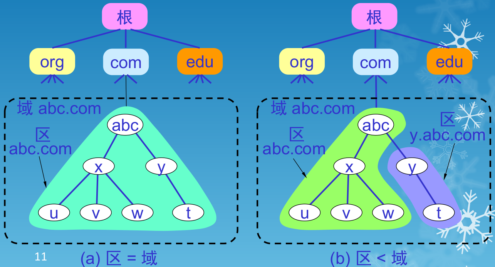

### 树状结构的 DNS 域名服务器

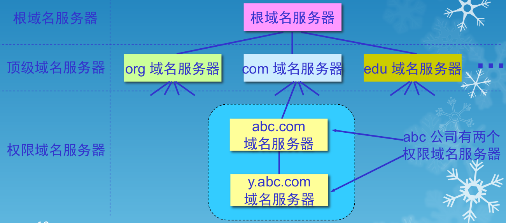

### 域名服务器类型

- 根域名服务器
- 顶级域名服务器
- 权限域名服务器
- 本地域名服务器

### 根域名服务器(最高层次的域名服务器)

- 根域名服务器是最重要的域名服务器。所有的根域名服务器都知道所有的顶级域名服务器的域名和 IP 地址

- 不管是哪一个本地域名服务器,若要对因特网上任何一个域名进行解析,只要自己无法解析,就首先求助于根域名服务器

- 在因特网上共有13 个不同 IP 地址的根域名服务器,它们的名字是用一个英文字母命名,从a 一直到 m(前13 个字母)

  ```
  a.rootservers.net
  b.rootservers.net
  ...
  m.rootservers.net
  ```

- 这样做的目的是为了方便用户,使世界上大部分DNS 域名服务器都能就近找到一个根域名服务器
- 根域名服务器并不直接把域名直接转换成 IP 地址
- 在使用迭代查询时，根域名服务器把下一步应当找的顶级域名服务器的 IP 地址告诉本地域名服务器

### 顶级域名服务器(TLD 服务器)

- 这些域名服务器负责管理在该顶级域名服务器注册的所有二级域名
- 当收到 DNS 查询请求时,就给出相应的回答(可能是最后的结果,也可能是下一步应当找的域名服务器的 IP 地址)

### 权限域名服务器

- 负责一个区的域名服务器
- 当一个权限域名服务器还不能给出最后的查询回答时,就会告诉发出查询请求的 DNS 客户,下一步应当找哪一个权限域名服务器

### 本地域名服务器

- 本地域名服务器对域名系统非常重要
- 当一个主机发出 DNS 查询请求时,这个查询请求报文就发送给本地域名服务器
- 每一个因特网服务提供者 ISP,或一个大学,甚至一个大学里的系,都可以拥有一个本地域名服务器,这种域名服务器有时也称为默认域名服务器

### 提高域名服务器的可靠性

- DNS 域名服务器都把数据复制到几个域名服务器来保存,其中的一个是主域名服务器,其他的是辅助域名服务器
- 当主域名服务器出故障时,辅助域名服务器可以保证 DNS 的查询工作不会中断
- 主域名服务器定期把数据复制到辅助域名服务器中,而更改数据只能在主域名服务器中进行。这样就保证了数据的一致性

### 域名的解析过程

- 主机向本地域名服务器的查询一般都是采用递归查询。如果主机所询问的本地域名服务器不知道被查询域名的 IP 地址,那么本地域名服务器就以DNS 客户的身份,向其他根域名服务器继续发出查询请求报文

- 本地域名服务器向根域名服务器的查询通常是采用迭代查询。当根域名服务器收到本地域名服务器的迭代查询请求报文时,要么给出所要查询的IP 地址,要么告诉本地域名服务器:“你下一步应当向哪一个域名服务器进行查询”。然后让本地域名服务器进行后续的查询

  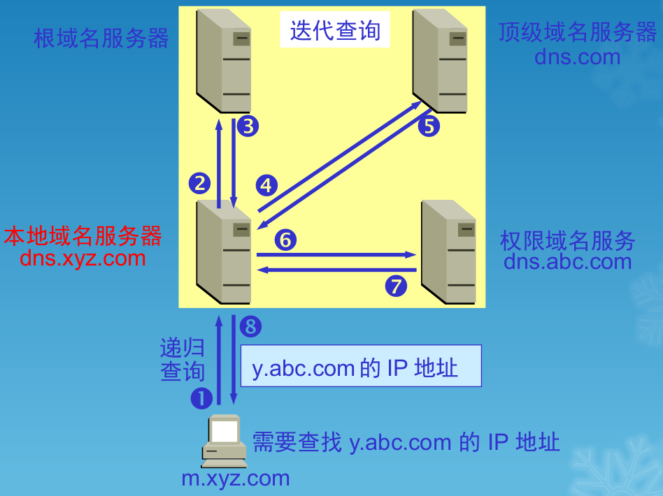

  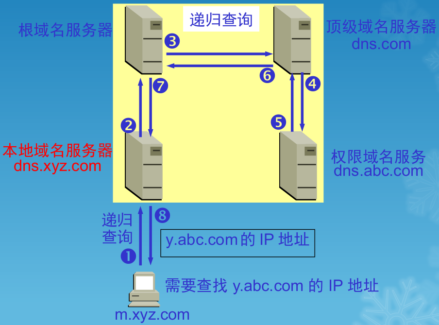

### 名字的高速缓存

- 每个域名服务器都维护一个高速缓存,存放最近用过的名字以及从何处获得名字映射信息的记录
- 可大大减轻根域名服务器的负荷,使因特网上的 DNS 查询请求和回答报文的数量大为减少
- 为保持高速缓存中的内容正确,域名服务器应为每项内容设置计时器,并处理超过合理时间的项(例如,每个项目只存放两天)
- 当权限域名服务器回答一个查询请求时,在响应中都指明绑定有效存在的时间值。增加此时间值可减少网络开销,而减少此时间值可提高域名转换的准确性

---


## 万维网 WWW

- 万维网 WWW (World Wide Web)并非某种特殊的计算机网络
- 万维网是一个大规模的、联机式的信息储藏所
- 万维网用链接的方法能非常方便地从因特网上的一个站点访问另一个站点,从而主动地按需获取丰富的信息
- 这种访问方式称为“链接”

### 万维网提供分布式服务

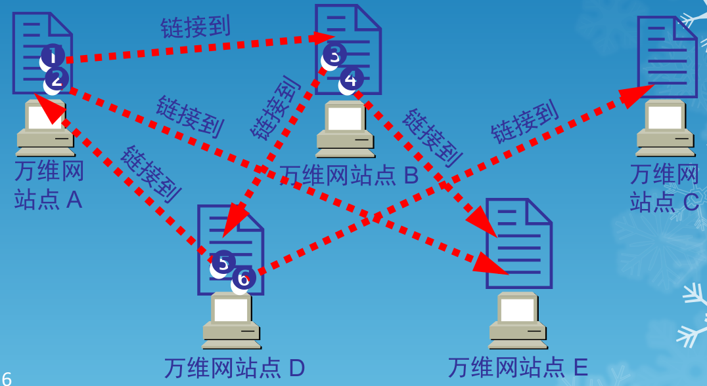

### 超媒体与超文本

- 万维网是分布式超媒体(hypermedia)系统,它是超文本(hypertext)系统的扩充
- 一个超文本由多个信息源链接成。利用一个链接可使用户找到另一个文档。这些文档可以位于世界上任何一个接在因特网上的超文本系统中。超文本是万维网的基础。
- 超媒体与超文本的区别是文档内容不同。超文本文档仅包含文本信息,而超媒体文档还包含其他表示方式的信息,如图形、图像、声音、动画,甚至活动视频图像

### 万维网的工作方式

- 万维网以客户服务器方式工作
- 浏览器就是在用户计算机上的万维网客户程序。万维网文档所驻留的计算机则运行服务器程序,因此这个计算机也称为万维网服务器
- 客户程序向服务器程序发出请求,服务器程序向客户程序送回客户所要的万维网文档
- 在一个客户程序主窗口上显示出的万维网文档称为页面(page)

### 必须解决的问题

- 怎样标志分布在整个因特网上的万维网文档?
  - 使用统一资源定位符 URL (Uniform Resource Locator)来标志万维网上的各种文档
  - 使每一个文档在整个因特网的范围内具有唯一的标识符 URL
- 用何协议实现万维网上各种超链的链接?
  - 在万维网客户程序与万维网服务器程序之间进行交互所使用的协议,是超文本传送协议 HTTP(HyperText Transfer Protocol)
  - HTTP 是一个应用层协议,它使用 TCP 连接进行可靠的传送
- 怎样使各种万维网文档都能在因特网上的各种计算机上显示出来,同时使用户清楚地知道在什么地方存在着超链?
  - 超 文 本 标 记 语 言 HTML (HyperText Markup Language)使得万维网页面的设计者可以很方便地用一个超链从本页面的某处链接到因特网上的任何一个万维网页面,并且能够在自己的计算机屏幕上将这些页面显示出来
- 怎样使用户能够很方便地找到所需的信息?
  - 为了在万维网上方便地查找信息,用户可使用各种的搜索工具(即搜索引擎)

### 统一资源定位符 URL

- 统一资源定位符 URL 是对可以从因特网上得到的资源的位置和访问方法的一种简洁的表示
- URL 给资源的位置提供一种抽象的识别方法,并用这种方法给资源定位
- 只要能够对资源定位,系统就可以对资源进行各种操作,如存取、更新、替换和查找其属性
- URL 相当于一个文件名在网络范围的扩展。因此URL 是与因特网相连的机器上的任何可访问对象的一个指针

### URL 的一般形式

- 由以冒号隔开的两大部分组成,并且在 URL 中的字符对大写或小写没有要求
- URL 的一般形式是：**<协议>://<主机>:<端口>/<路径>**

### 超文本传送协议 HTTP

- 为了使超文本的链接能够高效率地完成,需要用HTTP 协议来传送一切必须的信息
- 从层次的角度看 , HTTP是面向事务的(transaction-oriented)应用层协议,它是万维网上能够可靠地交换文件(包括文本、声音、图像等各种多媒体文件)的重要基础

### 万维网的工作过程

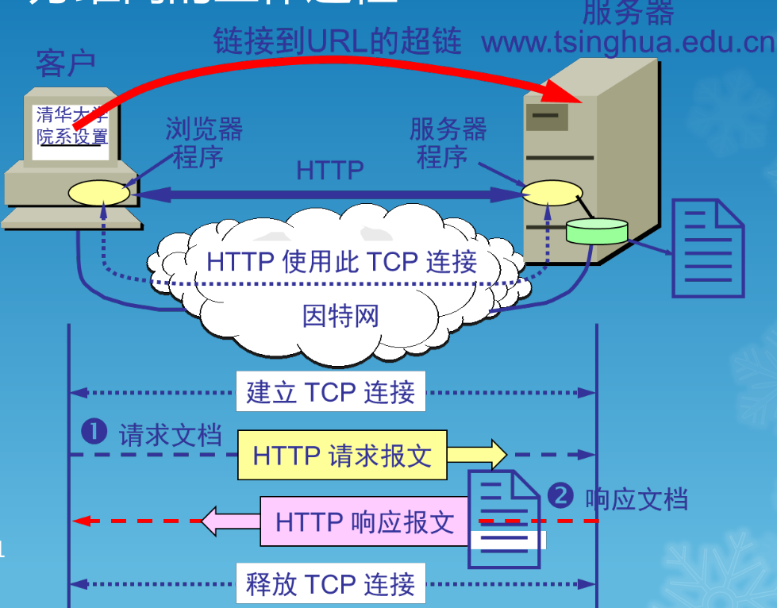

### HTTP 的主要特点

- HTTP 是面向事务的客户服务器协议
- HTTP 1.0 协议是无状态的(stateless)
- HTTP 协议本身也是无连接的,虽然它使用了面向连接的 TCP 向上提供的服务

### 请求一个万维网文档所需的时间

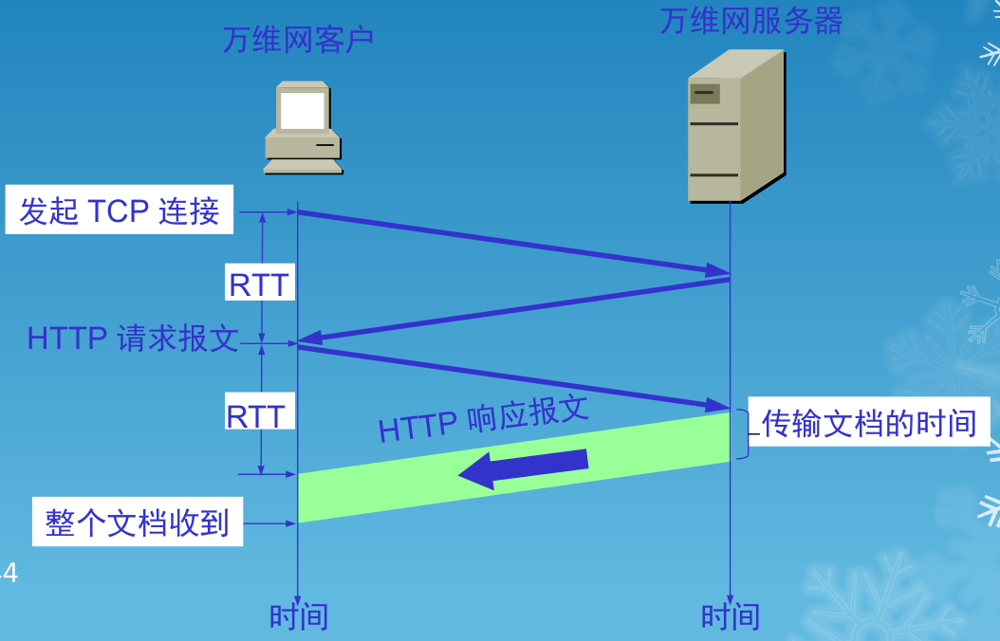

### 持续连接(persistent connection)

- HTTP/1.1 协议使用持续连接
- 万维网服务器在发送响应后仍然在一段时间内保持这条连接,使同一个客户(浏览器)和该服务器可以继续在这条连接上传送后续的 HTTP 请求报文和响应报文
- 这并不局限于传送同一个页面上链接的文档,而是只要这些文档都在同一个服务器上就行

### 持续连接的两种工作方式

- 非流水线方式:客户在收到前一个响应后才能发出下一个请求。这比非持续连接的两倍 RTT 的开销节省了建立 TCP 连接所需的一个 RTT 时间。但服务器在发送完一个对象后,其 TCP 连接就处于空闲状态,浪费了服务器资源
- 流水线方式:客户在收到 HTTP 的响应报文之前就能够接着发送新的请求报文。一个接一个的请求报文到达服务器后,服务器就可连续发回响应报文。使用流水线方式时,客户访问所有的对象只需花费一个 RTT时间,使 TCP 连接中的空闲时间减少,提高了下载文档效率

### 代理服务器(proxy server)

- 代理服务器(proxy server)又称为万维网高速缓存(Web cache),它代表浏览器发出 HTTP 请求
- 万维网高速缓存把最近的一些请求和响应暂存在本地磁盘中
- 当与暂时存放的请求相同的新请求到达时,万维网高速缓存就把暂存的响应发送出去,而不需要按 URL 的地址再去因特网访问该资源

### 使用高速缓存可减少访问因特网服务器的时延

- 浏览器访问因特网的服务器时,要先与校园网的高速缓存建立 TCP 连接,并向高速缓存发出 HTTP 请求报文
- 若高速缓存已经存放了所请求的对象,则将此对象放入HTTP 响应报文中返回给浏览器
- 否则,高速缓存就代表发出请求的用户浏览器,与因特网上的源点服务器建立 TCP 连接,并发送 HTTP 请求报文
- 源点服务器将所请求的对象放在 HTTP 响应报文中返回给校园网的高速缓存
- 高速缓存收到此对象后,先复制在其本地存储器中(为今后使用),然后再将该对象放在 HTTP 响应报文中,通过已建立的 TCP 连接,返回给请求该对象的浏览器

### HTTP 的报文结构

- 请求报文——从客户向服务器发送请求报文

  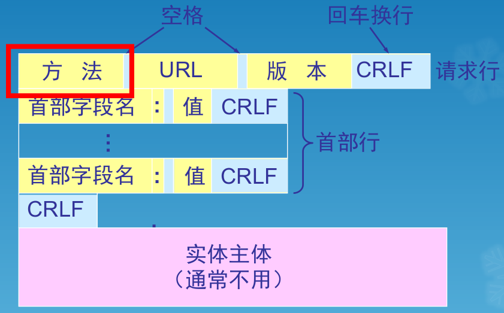

- 响应报文——从服务器到客户的回答

  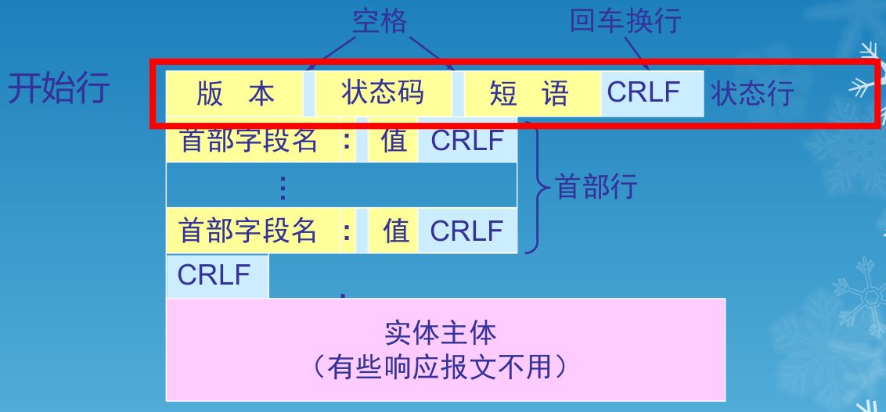

- 由于 HTTP 是面向正文的(text-oriented),因此在报文中的每一个字段都是一些 ASCII 码串,因而每个字段的长度都是不确定的

### 状态码都是三位数字

- 1xx 表示通知信息的,如请求收到了或正在进行处理
- 2xx 表示成功,如接受或知道了
- 3xx 表示重定向,表示要完成请求还必须采取进一步的行动
- 4xx 表示客户的差错,如请求中有错误的语法或不能完成
- 5xx 表示服务器的差错,如服务器失效无法完成请求

### 在服务器上存放用户的信息

- 万维网站点使用 Cookie 来跟踪用户
- Cookie 表示在 HTTP 服务器和客户之间传递的状态信息
- 使用 Cookie 的网站服务器为用户产生一个唯一的识别码。利用此识别码,网站就能够跟踪该用户在该网站的活动

### 超文本标记语言 HTML

- 超文本标记语言 HTML 中的 Markup 的意思就是“设置标记”
- HTML 定义了许多用于排版的命令(即标签)
- HTML 把各种标签嵌入到万维网的页面中。这样就构成了所谓的 HTML 文档。HTML 文档是一种可以用任何文本编辑器创建的 ASCII 码文件

### HTML 文档

- 仅当 HTML 文档是以.html 或 .htm 为后缀时,浏览器才对此 文档的各种标签进行解释
- 如 HTML 文档改换以 .txt 为其后缀,则 HTML解释程序就不对标签进行解释,而浏览器只能看见原来的文本文件
- 当浏览器从服务器读取 HTML 文档后,就按照HTML 文档中的各种标签,根据浏览器所使用的显示器的尺寸和分辨率大小,重新进行排版并恢复出所读取的页面

### 两种不同的链接

- 远程链接:超链的终点是其他网点上的页面
- 本地链接:超链指向本计算机中的某个文件

### 动态万维网文档

- 静态文档是指该文档创作完毕后就存放在万维网服务器中,在被用户浏览的过程中,内容不会改变
- 动态文档是指文档的内容是在浏览器访问万维网服务器时才由应用程序动态创建
- 动态文档和静态文档之间的主要差别体现在服务器一端。这主要是文档内容的生成方法不同。而从浏览器的角度看,这两种文档并没有区别

### 万维网服务器功能的扩充

- 应增加另一个应用程序,用来处理浏览器发来的数据,并创建动态文档
- 应增加一个机制,用来使万维网服务器把浏览器发来的数据传送给这个应用程序,然后万维网服务器能够解释这个应用程序的输出,并向浏览器返回 HTML 文档

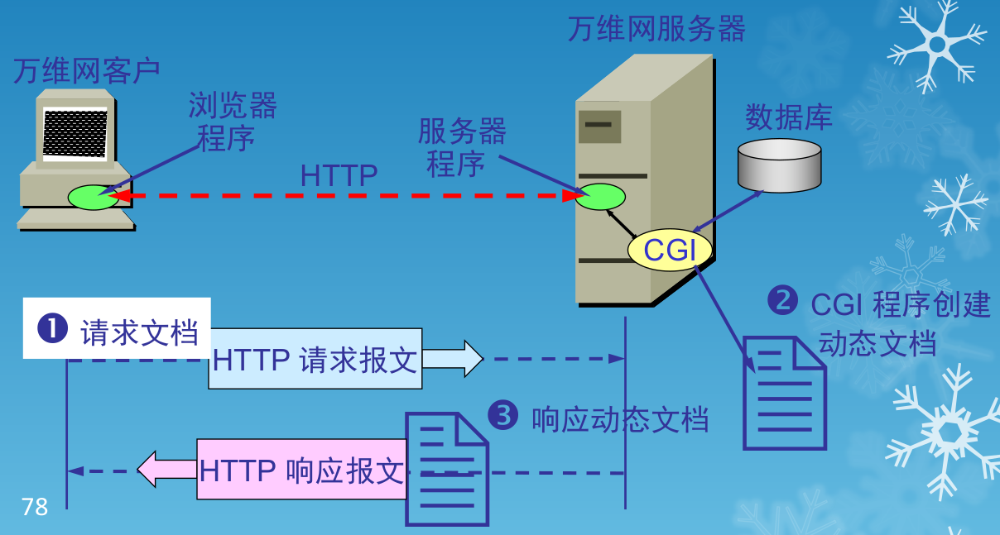

### 通用网关接口 CGI(Common Gateway Interface)

- CGI 是一种标准,它定义了动态文档应如何创建,输入数据应如何提供给应用程序,以及输出结果应如何使用
- 万维网服务器与 CGI 的通信遵循 CGI 标准
- “通用”:CGI 标准所定义的规则对其他任何语言都是通用的
- “网关”:CGI 程序的作用像网关
- “接口”:有一些已定义好的变量和调用等可供其他 CGI 程序使用

### CGI 程序

- CGI 程序的正式名字是 CGI 脚本(script)
- “脚本”指的是一个程序,它被另一个程序(解释程序)而不是计算机的处理机来解释或执行
- 脚本运行起来要比一般的编译程序要慢,因为它的每一条指令先要被另一个程序来处理(这就要一些附加的指令),而不是直接被指令处理器来处理

### 活动万维网文档

- 活动文档(active document)技术把所有的工作都转移给浏览器端
- 每当浏览器请求一个活动文档时,服务器就返回一段程序副本在浏览器端运行
- 活动文档程序可与用户直接交互,并可连续地改变屏幕的显示
- 由于活动文档技术不需要服务器的连续更新传送,对网络带宽的要求也不会太高

### 活动文档在客户端创建

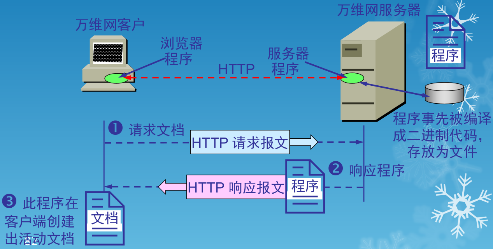

### 用 Java 技术创建活动文档

- 由美国 Sun 公司开发的 Java 语言是一项用于创建和运行活动文档的技术
- 在 Java 技术中使用 “小应用程序”(applet)来描述活动文档程序
- 用户从万维网服务器下载嵌入了 Java 小应用程序的 HTML 文档后,可在浏览器的屏幕上点击某个图像,就可看到动画效果,或在下拉式菜单中点击某个项目,就可看到计算结果
- Java 技术是活动文档技术的一部分

### 万维网的信息检索系统

- 全文检索搜索
  - 在万维网中用来进行搜索的程序叫做搜索引擎
  - 全文检索搜索引擎是一种纯技术型的检索工具。它的工作原理是通过搜索软件到因特网上的各网站收集信息,找到一个网站后可以从这个网站再链接到另一个网站。然后按照一定的规则建立一个很大的在线数据库供用户查询
  - 用户在查询时只要输入关键词,就从已经建立的索引数据库上进行查询(并不是实时地在因特网上检索到的信息)
- 分类目录搜索
  - 分类目录搜索引擎并不采集网站的任何信息,而是利用各网站向搜索引擎提交的网站信息时填写的关键词和网站描述等信息,经过人工审核编辑后,如果认为符合网站登录的条件,则输入到分类目录的数据库中,供网上用户查询
  - 分类目录搜索也叫做分类网站搜索

---


## 电子邮件

### 电子邮件的一些标准

- 发送邮件的协议:SMTP
- 读取邮件的协议:POP3 和 IMAP
- MIME 在其邮件首部中说明了邮件的数据类型(如文本、声音、图像、视像等),使用 MIME 可在邮件中同时传送多种类型的数据

### 用户代理 UA (User Agent)

- 用户代理 UA 就是用户与电子邮件系统的接口,是电子邮件客户端软件
- 用户代理的功能:撰写、显示、处理和通信
- 邮件服务器的功能是发送和接收邮件,同时还要向发信人报告邮件传送的情况(已交付、被拒绝、丢失等)
- 邮件服务器按照客户服务器方式工作。邮件服务器需要使用发送和读取两个不同的协议

### 发送和接收电子邮件的步骤

- 发件人调用 PC 机中的用户代理撰写和编辑要发送的邮件
- 发件人的用户代理把邮件用 SMTP 协议发给发送方邮件服务器
- SMTP 服务器把邮件临时存放在邮件缓存队列中,等待发送
- 发送方邮件服务器的 SMTP 客户与接收方邮件服务器的 SMTP 服务器建立 TCP 连接,然后就把邮件缓存队列中的邮件依次发送出去
- 运行在接收方邮件服务器中的SMTP服务器进程收到邮件后,把邮件放入收件人的用户邮箱中,等待收件人进行读取
- 收件人在打算收信时,就运行 PC 机中的用户代理,使用 POP3(或 IMAP)协议读取发送给自己的邮件
- POP3 服务器和 POP3 客户之间的通信是由 POP3 客户发起的

### 电子邮件的组成

- 电子邮件由信封(envelope)和内容(content)两部分组成
- 电子邮件的传输程序根据邮件信封上的信息来传送邮件。用户在从自己的邮箱中读取邮件时才能见到邮件的内容
- 在邮件的信封上,最重要的就是收件人的地址

### 电子邮件地址的格式

- TCP/IP 体系的电子邮件系统规定电子邮件地址的格式为：收件人邮箱名@邮箱所在主机的域名
- 用户名在域名内是唯一的，邮箱所在的主机的域名在全世界必须是唯一的

### 简单邮件传送协议 SMTP

- SMTP 所规定的就是在两个相互通信的 SMTP 进程之间应如何交换信息
- 由于 SMTP 使用客户服务器方式,因此负责发送邮件的 SMTP 进程就是 SMTP 客户,而负责接收邮件的 SMTP 进程就是 SMTP 服务器

### SMTP 通信的三个阶段

- 连接建立:连接是在发送主机的 SMTP 客户和接收主机的 SMTP 服务器之间建立的。SMTP不使用中间的邮件服务器
- 邮件传送
- 连接释放:邮件发送完毕后,SMTP 应释放 TCP 连接

### 电子邮件的信息格式

- 一个电子邮件分为信封和内容两大部分
- RFC 822 只规定了邮件内容中的首部(header)格式,而对邮件的主体(body)部分则让用户自由撰写
- 用户写好首部后,邮件系统将自动地将信封所需的信息提取出来并写在信封上。所以用户不需要填写电子邮件信封上的信息
- 邮件内容首部包括一些关键字,后面加上冒号。最重要的关键字是 To 和 Subject

### 邮件读取协议POP3

- 邮局协议 POP 是一个非常简单、但功能有限的邮件读取协议,现在使用的是它的第三个版本POP3
- POP 也使用客户服务器的工作方式
- 在接收邮件的用户 PC 机中必须运行 POP 客户程序,而在用户所连接的 ISP 的邮件服务器中则运行 POP 服务器程序

### IMAP 协议

- Internet Message Access Protocol
- IMAP 也是按客户服务器方式工作,现在较新的是版本 4,即 IMAP4
- 用户在自己的 PC 机上就可以操纵 ISP 的邮件服务器的邮箱,就像在本地操纵一样
- 因此 IMAP 是一个联机协议。当用户 PC 机上的IMAP 客户程序打开 IMAP 服务器的邮箱时,用户就可看到邮件的首部。若用户需要打开某个邮件,则该邮件才传到用户的计算机上

### IMAP 的特点

- IMAP最大的好处就是用户可以在不同的地方使用不同的计算机随时上网阅读和处理自己的邮件
- IMAP 还允许收件人只读取邮件中的某一个部分。例如,收到了一个带有视像附件(此文件可能很大)的邮件。为了节省时间,可以先下载邮件的正文部分,待以后有时间再读取或下载这个很长的附件
- IMAP 的缺点是如果用户没有将邮件复制到自己的PC 机上,则邮件一直是存放在 IMAP 服务器上。因此用户需要经常与 IMAP 服务器建立连接

> 注意：
>
> - 不要将邮件读取协议 POP 或 IMAP 与邮件传送协议 SMTP 弄混
> - 发信人的用户代理向源邮件服务器发送邮件,以及源邮件服务器向目的邮件服务器发送邮件,都是使用 SMTP 协议
> - 而 POP 协议或 IMAP 协议则是用户从目的邮件服务器上读取邮件所使用的协议

### 基于万维网的电子邮件

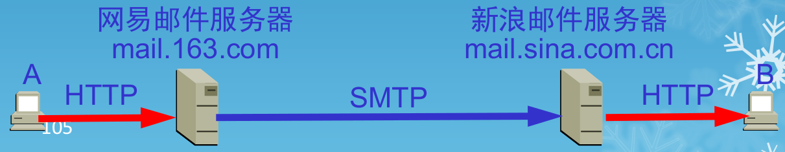

- 电子邮件从 A 发送到网易邮件服务器是使用HTTP 协议
- 两个邮件服务器之间的传送使用 SMTP
- 邮件从新浪邮件服务器传送到 B 是使用 HTTP 协议

### SMTP 的缺点

- SMTP 不能传送可执行文件或其他的二进制对象
- SMTP 限于传送 7 位的 ASCII 码。许多其他非英语国家的文字(如中文、俄文,甚至带重音符号的法文或德文)就无法传送
- SMTP 服务器会拒绝超过一定长度的邮件
- 某些 SMTP 的实现并没有完全按照[RFC 821]的 SMTP 标准

### 通用因特网邮件扩充 MIME

- MIME 并没有改动 SMTP 或取代它
- MIME 的意图是继续使用目前的[RFC 822]格式,但增加了邮件主体的结构,并定义了传送非 ASCII 码的编码规则

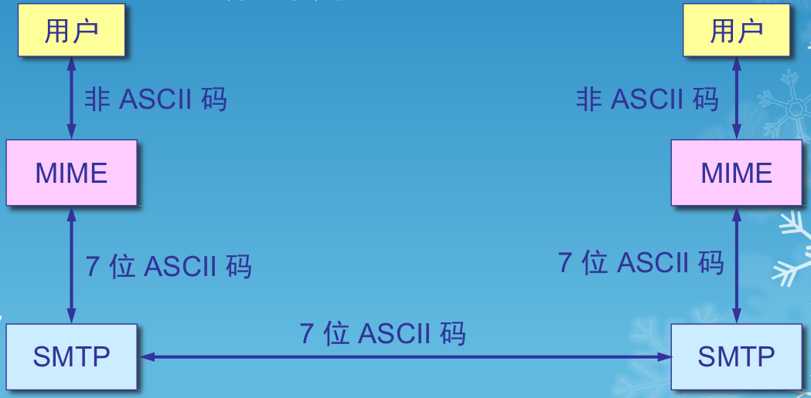

### MIME 主要包括三个部分

- 5 个新的邮件首部字段,它们可包含在[RFC 822]首部中。这些字段提供了有关邮件主体的信息
- 定义了许多邮件内容的格式,对多媒体电子邮件的表示方法进行了标准化
- 定义了传送编码,可对任何内容格式进行转换,而不会被邮件系统改变

### MIME 增加 5 个新的邮件首部

- MIME-Version: 标志 MIME 的版本。现在的版本号是 1.0。若无此行,则为英文文本
- Content-Description: 这是可读字符串,说明此邮件是什么。和邮件的主题差不多
- Content-Id: 邮件的唯一标识符
- Content-Transfer-Encoding: 在传送时邮件的主体是如何编码的
- Content-Type: 说明邮件的性质

---


## 动态主机配置协议

- 为了将软件协议做成通用的和便于移植,协议软件的编写者把协议软件参数化。这就使得在很多台计算机上使用同一个经过编译的二进制代码成为可能
- 一台计算机和另一台计算机的区别,都可通过一些不同的参数来体现
- 在软件协议运行之前,必须给每一个参数赋值

### 协议配置

- 在协议软件中给这些参数赋值的动作叫做协议配置
- 一个软件协议在使用之前必须是已正确配置的
- 需要配置的项目：
  - IP 地址
  - 子网掩码
  - 默认路由器的 IP 地址
  - 域名服务器的 IP 地址
- 这些信息通常存储在一个配置文件中,计算机在引导过程中可以对这个文件进行存取
- 信息有哪些则取决于协议栈

### 动态主机配置协议 DHCP

- Dynamic Host Configuration Protocol
- 动态主机配置协议 DHCP 提供了即插即用连网(plug-and-play networking)的机制
- 这种机制允许一台计算机加入新的网络和获取IP地址而不用手工参与

### DHCP 使用客户服务器方式

- 需要 IP 地址的主机在启动时就向 DHCP 服务器广播发送发现报文(DHCPDISCOVER),这时该主机就成为 DHCP 客户
- 本地网络上所有主机都能收到此广播报文,但只有 DHCP 服务器才回答此广播报文
- DHCP 服务器先在其数据库中查找该计算机的配置信息。若找到,则返回找到的信息。若找不到,则从服务器的 IP 地址池(address pool)中取一个地址分配给该计算机。DHCP 服务器的回答报文叫做提供报文(DHCPOFFER)

### DHCP 中继代理(relay agent)

- 并不是每个网络上都有 DHCP 服务器,这样会使 DHCP 服务器的数量太多。现在是每一个网络至少有一个 DHCP 中继代理,它配置了 DHCP 服务器的 IP 地址信息
- 当 DHCP 中继代理收到主机发送的发现报文后,就以单播方式向 DHCP 服务器转发此报文,并等待其回答。收到 DHCP 服务器回答的提供报文后,DHCP 中继代理再将此提供报文发回给主机

### DHCP 中继代理以单播方式转发发现报文

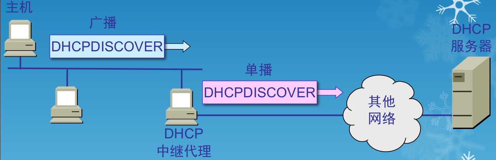

> 注意：DHCP 报文只是 UDP 用户数据报中的数据

### 租用期(lease period)

- DHCP 服务器分配给 DHCP 客户的 IP 地址的临时的,因此 DHCP 客户只能在一段有限的时间内使用这个分配到的 IP 地址。DHCP 协议称这段时间为租用期
- 租用期的数值应由 DHCP 服务器自己决定
- DHCP 客户也可在自己发送的报文中(例如,发现报文)提出对租用期的要求

### DHCP 协议的工作过程

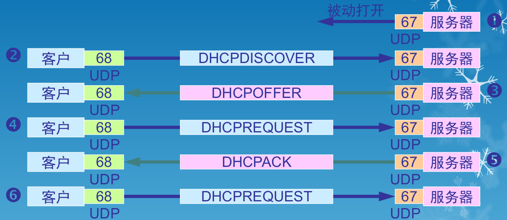

- DHCP 服务器被动打开 UDP 端口67，等待客户端发来的报文
- DHCP 客户从 UDP 端口68发送 DHCP 发现报文
- 凡收到 DHCP 发现报文的 DHCP 服务器都发出 DHCP 提供报文，因此 DHCP 客户可能收到多个 DHCP 提供报文
- DHCP 客户从几个 DHCP 服务器中选择其中一个，并向所选择的 DHCP 服务器发送 DHCP 请求报文
  - 被选择的 DHCP 服务器发送确认报文 DHCPACK，进入已绑定状态，并可开始使用得到的临时 IP 地址。DHCP 客户现在要根据服务器提供的租用期 T 设置两个计时器 T1 和 T2，它们的超时时间分别是0.5T 和 0.875T。当超时时间到就要请求更新租用期
- 租用期过了一半（T1 时间到），DHCP 发送请求报文 DHCPREQUEST 要求更新租用期
- DHCP 服务器若同意，则发回确认报文 DHCPACK。DHCP 客户得到了新的租用期，重新设置计时器
- DHCP 服务器若不同意，则发回否认报文 DHCPNACK。这时 DHCP 客户必须立即停止使用原来的 IP 地址，而必须重新申请 IP 地址（回到步骤2）。若 DHCP 服务器不响应步骤6的请求报文 DHCPREQUEST，则在租用期过了87.5%时，DHCP 客户必须重新发送请求报文 DHCPREQUEST（重复步骤6），然后继续后面步骤
- DHCP 客户可随时提前终止服务器所提供的租用期，这时只需向 DHCP 服务器发送释放报文 DHCPRELEASE 即可