# WEEK 7

## 网络安全问题概述

### 计算机网络通信的四种威胁

- 计算机网络上的通信面临以下的四种威胁
  - 截获——从网络上窃听他人的通信内容
  - 中断——有意中断他人在网络上的通信
  - 篡改——故意篡改网络上传送的报文
  - 伪造——伪造信息在网络上传送
- 截获信息的攻击称为被动攻击,而更改信息和拒绝用户使用资源的攻击称为主动攻击

### 被动攻击和主动攻击

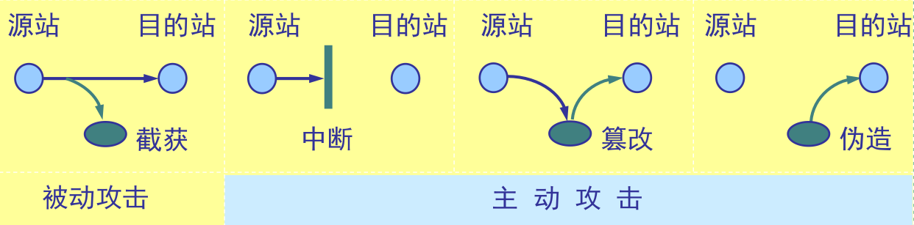

- 在被动攻击中,攻击者只是观察和分析某一个协议数据单元 PDU 而不干扰信息流
- 主动攻击是指攻击者对某个连接中通过的 PDU 进行各种处理
  - 更改报文流
  - 拒绝报文服务
  - 伪造连接初始化

### 计算机网络通信安全的目标

- 防止析出报文内容
- 防止通信量分析
- 检测更改报文流
- 检测拒绝报文服务
- 检测伪造初始化连接

### 恶意程序(rogue program)

- 计算机病毒——会“传染”其他程序的程序,“传染”是通过修改其他程序来把自身或其变种复制进去完成的
- 计算机蠕虫——通过网络的通信功能将自身从一个结点发送到另一个结点并启动运行的程序
- 特洛伊木马——一种程序,它执行的功能超出所声称的功能(伪装)
- 逻辑炸弹——一种当运行环境满足某种特定条件时执行其他特殊功能的程序

---

## 密码体制

### 计算机网络安全的内容

- 保密性
- 安全协议的设计
- 访问控制

### 一般的数据加密模型

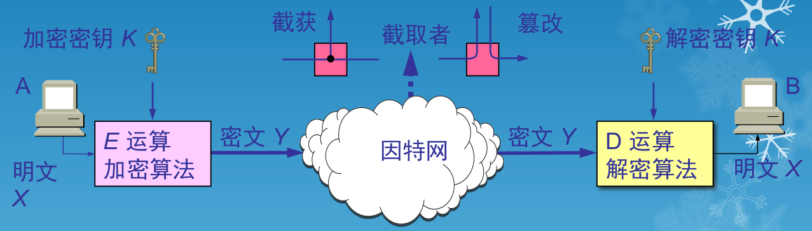

### 重要概念

- 密码编码学(cryptography)是密码体制的设计学,而密码分析学(cryptanalysis)则是在未知密钥的情况下从密文推演出明文或密钥的技术。密码编码学与密码分析学合起来即为密码学(cryptology)
- 如果不论截取者获得了多少密文,但在密文中都没有足够的信息来唯一地确定出对应的明文,则这一密码体制称为无条件安全的,或称为理论上是不可破的
- 如果密码体制中的密码不能被可使用的计算资源破译,则这一密码体制称为在计算上是安全的

### 对称密钥密码体制

- 所谓常规密钥密码体制,即加密密钥与解密密钥是相同的密码体制
- 这种加密系统又称为对称密钥系统

### 数据加密标准 DES

- 数据加密标准 DES 属于常规密钥密码体制,是一种分组密码
- 在加密前,先对整个明文进行分组。每一个组长为 64 位
- 然后对每一个 64 位二进制数据进行加密处理,产生一组 64 位密文数据
- 最后将各组密文串接起来,即得出整个的密文
- 使用的密钥为 64 位(实际密钥长度为 56 位,有 8 位用于奇偶校验)

### DES 的保密性

- DES 的保密性仅取决于对密钥的保密,而算法是公开的。尽管人们在破译 DES 方面取得了许多进展,但至今仍未能找到比穷举搜索密钥更有效的方法
- DES 是世界上第一个公认的实用密码算法标准,它曾对密码学的发展做出了重大贡献
- 目前较为严重的问题是 DES 的密钥的长度。现在已经设计出来搜索 DES 密钥的专用芯片

### 公钥密码体制

- 公钥密码体制使用不同的加密密钥与解密密钥,是一种“由已知加密密钥推导出解密密钥在计算上是不可行的”密码体制
- 公钥密码体制的产生主要是因为两个方面的原因,一是由于常规密钥密码体制的密钥分配问题,另一是由于对数字签名的需求
- 现有最著名的公钥密码体制是 RSA 体制,它基于数论中大数分解问题的体制,由美国三位科学家 Rivest, Shamir 和 Adleman 于 1976 年提出并在 1978 年正式发表的

### 加密密钥与解密密钥

- 在公钥密码体制中,加密密钥(即公钥) $PK$ 是公开信息,而解密密钥(即私钥或秘钥) $SK$ 是需要保密的
- 加密算法 $E$ 和解密算法 $D$ 也都是公开的
- 虽然秘钥 $SK$ 是由公钥 $PK$ 决定的,但却不能根据 $PK$ 计算出 $SK$

> 注意：
>
> - 任何加密方法的安全性取决于密钥的长度,以及攻破密文所需的计算量。在这方面,公钥密码体制并不具有比传统加密体制更加优越之处
> - 由于目前公钥加密算法的开销较大,在可见的将来还看不出来要放弃传统的加密方法。公钥还需要密钥分配协议,具体的分配过程并不比采用传统加密方法时更简单

### 公钥算法的特点

- 发送者 A 用 B 的公钥 $PK_B$ 对明文 $X$ 加密($E$ 运算)后,在接收者 B 用自己的私钥 $SK_B$ 解密($D$ 运算),即可恢复出明文
  $$
  D_{SK_B}(Y)=D_{SK_B}(E_{PK_B}(X))=X
  $$

- 解密密钥是接收者专用的秘钥,对其他人都保密

- 加密密钥是公开的,但不能用它来解密
  $$
  D_{PK_B}(E_{PK_B}(X))\neq X
  $$

- 加密和解密的运算可以对调
  $$
  D_{PK_B}(E_{SK_B}(X))=D_{SK_B}(E_{PK_B}(X))=X
  $$

- 在计算机上可容易地产生成对的 $PK$ 和 $SK$ 

- 从已知的 $PK$ 实际上不可能推导出 $SK$ ,即从 $PK$ 到 $SK$ 是“计算上不可能的”

- 加密和解密算法都是公开的

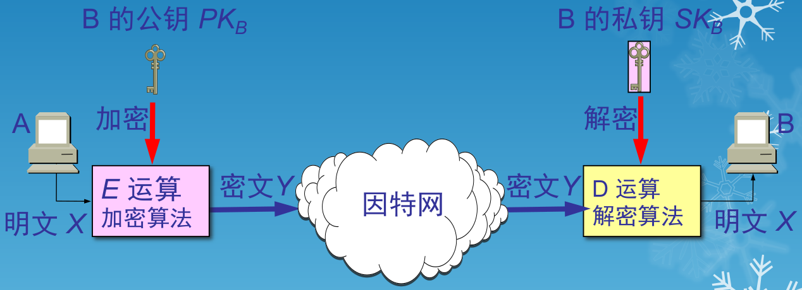

---

## 数字签名

- 数字签名必须保证以下三点
  - 报文鉴别——接收者能够核实发送者对报文的签名
  - 报文的完整性——发送者事后不能抵赖对报文的签名
  - 不可否认——接收者不能伪造对报文的签名
- 现在已有多种实现各种数字签名的方法。但采用公钥算法更容易实现

### 数字签名的实现

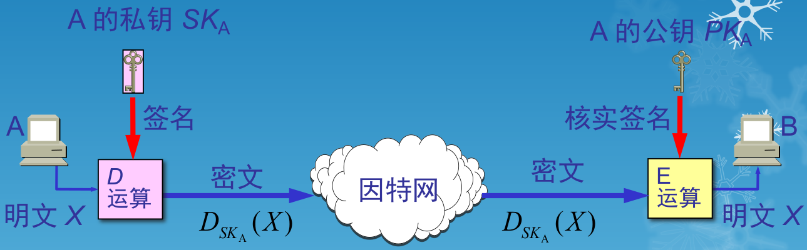

- 因为除 A 外没有别人能具有 A 的私钥,所以除 A 外没有别人能产生这个密文。因此 B 相信报文 X是 A 签名发送的
- 若 A 要抵赖曾发送报文给 B,B 可将明文和对应的密文出示给第三者。第三者很容易用 A 的公钥去证实 A 确实发送 X 给 B
- 反之,若 B 将 X 伪造成 X‘,则 B 不能在第三者前出示对应的密文。这样就证明了 B 伪造了报文

### 具有保密性的数字签名

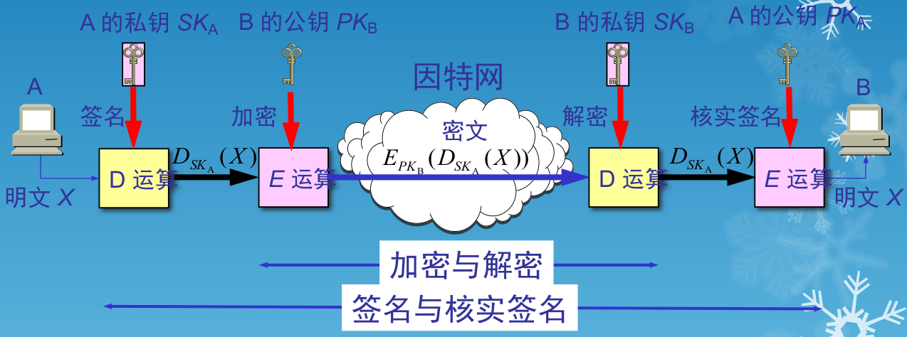

---

## 鉴别

- 在信息的安全领域中,对付被动攻击的重要措施是加密,而对付主动攻击中的篡改和伪造则要用鉴别(authentication) 
- 报文鉴别使得通信的接收方能够验证所收到的报文(发送者和报文内容、发送时间、序列等)的真伪
- 使用加密就可达到报文鉴别的目的。但在网络的应用中,许多报文并不需要加密。应当使接收者能用很简单的方法鉴别报文的真伪
- 鉴别与授权(authorization)是不同的概念。授权涉及到的问题是:所进行的过程是否被允许(如是否可以对某文件进行读或写)

### 报文鉴别

- 许多报文并不需要加密但却需要数字签名,以便让报文的接收者能够鉴别报文的真伪
- 然而对很长的报文进行数字签名会使计算机增加很大的负担(需要进行很长时间的运算)
- 当我们传送不需要加密的报文时,应当使接收者能用很简单的方法鉴别报文的真伪

### 报文摘要 MD (Message Digest)

- A 将报文 $X$ 经过报文摘要算法运算后得出很短的报文摘要 $H$。然后用自己的私钥对 $H$ 进行 $D$ 运算,即进行数字签名。得出已签名的报文摘要 $D(H)$ 后,并将其追加在报文 $X$ 后面发送给 B
- B 收到报文后首先把已签名的 D(H) 和报文 X 分离。然后再做两件事：
  - 用A的公钥对 $D(H)$ 进行 $E$ 运算,得出报文摘要 $H$
  - 对报文 $X$ 进行报文摘要运算,看是否能够得出同样的报文摘要 $H$。如一样,就能以极高的概率断定收到的报文是 A 产生的。否则就不是

### 报文摘要的优点

- 仅对短得多的定长报文摘要 $H$ 进行数字签名要比对整个长报文进行数字签名要简单得多,所耗费的计算资源也小得多
- 但对鉴别报文 $X$ 来说,效果是一样的。也就是说,报文 $X$ 和已签名的报文摘要 $D ( H ) $合在一起是不可伪造的,是可检验的和不可否认的

### 报文摘要算法

- 报文摘要算法就是一种散列函数。这种散列函数也叫做密码编码的检验和。报文摘要算法是防止报文被人恶意篡改
- 报文摘要算法是精心选择的一种单向函数
- 可以很容易地计算出一个长报文 X 的报文摘要 $H$,但要想从报文摘要 $H$ 反过来找到原始的报文 $X$,则实际上是不可能的
- 若想找到任意两个报文,使得它们具有相同的报文摘要,那么实际上也是不可能的

### 报文摘要的实现

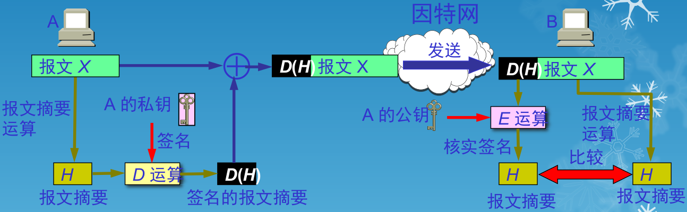

### 实体鉴别

- 实体鉴别和报文鉴别不同
- 报文鉴别是对每一个收到的报文都要鉴别报文的发送者,而实体鉴别是在系统接入的全部持续时间内对和自己通信的对方实体只需验证一次

### 最简单的实体鉴别过程

- A 发送给 B 的报文的被加密,使用的是对称密钥 $K_{AB}$ 
- B 收到此报文后,用共享对称密钥 $K_{AB}$ 进行解密,因而鉴别了实体 A 的身份

### 明显的漏洞

- 入侵者 C 可以从网络上截获 A 发给 B 的报文。C并不需要破译这个报文(因为这可能很花很多时间)而可以直接把这个由 A 加密的报文发送给 B,使 B 误认为 C 就是 A。然后 B 就向伪装是 A 的 C 发送应发给 A 的报文
- 这就叫做重放攻击(replay attack)。C 甚至还可以截获 A 的 IP 地址,然后把 A 的 IP 地址冒充为自己的 IP 地址(这叫做 IP 欺骗),使 B 更加容易受骗

### 使用不重数进行鉴别

- 为了对付重放攻击,可以使用不重数(nonce)。不重数就是一个不重复使用的大随机数,即“一次一数”

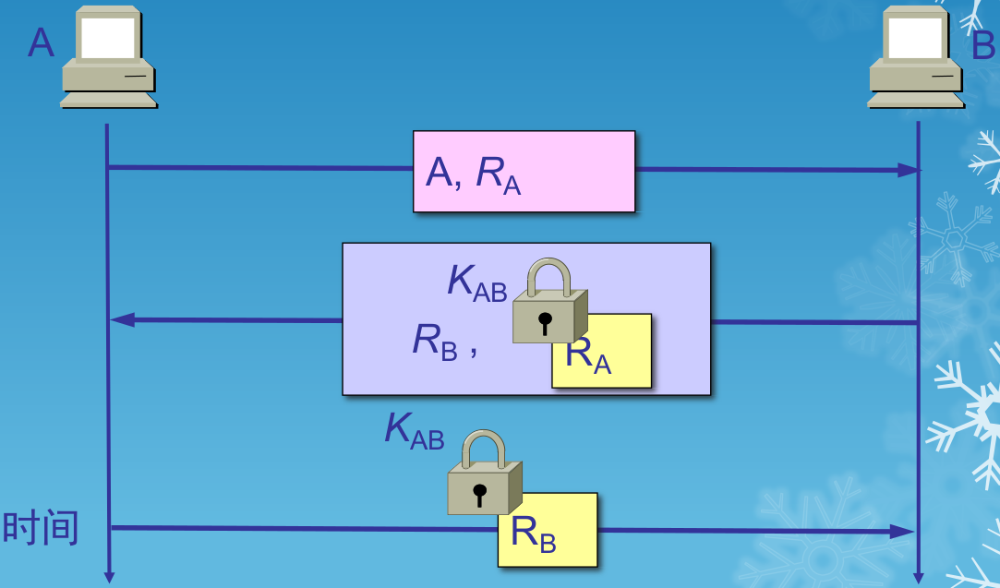

- 在使用公钥密码体制时，可以对不重数进行签名鉴别。B 用其私钥对不重数 RA 进行签名后发回给 A。A 用 B 的公钥核实签名。如能得出自己原来发送的不重数 RA，就核实了和自己通信的对方的确是 B。同样，A 也用自己的私钥对不重数 RB 进行签名后发送给 B。B 用 A 的公钥核实签名，鉴别了 A 的身份
- 公钥密码体制虽然不必在互相通信的用户之间秘密地分配共享密钥，但仍有受到攻击的可能

### 中间人攻击

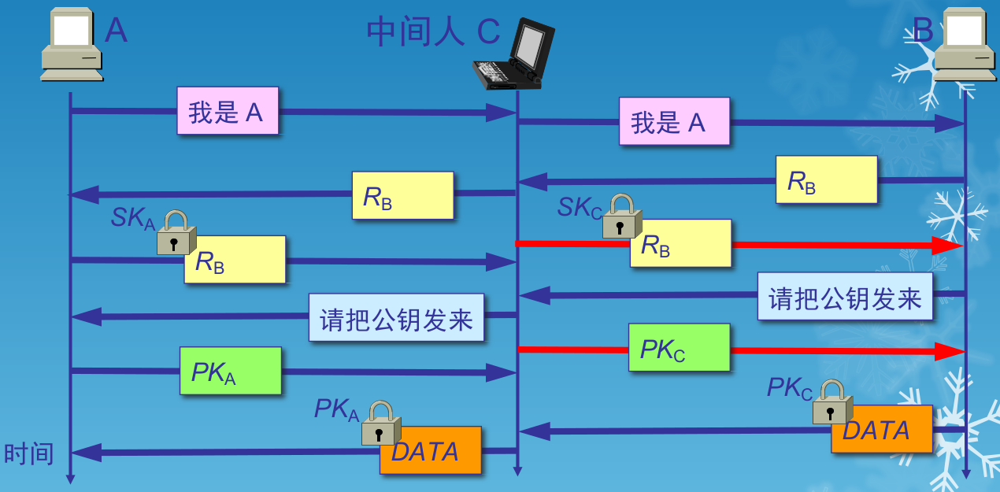

- A 向 B 发送“我是 A”的报文,并给出了自己的身份。此报文被“中间人” C 截获,C 把此报文原封不动地转发给 B。B 选择一个不重数 $R_B$ 发送给 A,但同样被 C 截获后也照样转发给 A
- 中间人 C 用自己的私钥 $SK_C$ 对 $R_B$ 加密后发回给 B,使 B 误以为是 A 发来的。A 收到 $R_B$ 后也用自己的私钥 $SK_A$ 对 $R_B$ 加密后发回给 B,中途被 C 截获并丢弃。B 向 A 索取其公钥,此报文被C截获后转发给 A
- C 把自己的公钥 $PK_C$ 冒充是 A 的发送给 B,而 C 也截获到 A 发送给 B 的公钥 $PK_A$ 
- B 用收到的公钥 $PK_C$ (以为是 A 的)对数据加密发送给 A。C 截获后用自己的私钥 $SK_C$ 解密,复制一份留下,再用 A 的公钥 $PK_A$ 对数据加密后发送给 A。A 收到数据后,用自己的私钥 $SK_A$ 解密,以为和B进行了保密通信。其实,B发送给A的加密数据已被中间人 C 截获并解密了一份。但 A 和 B 却都不知道

### 密钥分配

- 密钥管理包括:密钥的产生、分配、注入、验证和使用
- 密钥分配是密钥管理中最大的问题。密钥必须通过最安全的通路进行分配
- 目前常用的密钥分配方式是设立密钥分配中心 KDC(Key Distribution Center),通过 KDC 来分配密钥

### 对称密钥的分配

- KDC 是大家都信任的机构,其任务就是给需要进行秘密通信的用户临时分配一个会话密钥(仅使用一次)
- 用户 A 和 B 都是 KDC 的登记用户,并已经在 KDC 的服务器上安装了各自和 KDC 进行通信的主密钥(master key) $K_A$ 和 $K_B$ 。 “主密钥”可简称为“密钥”

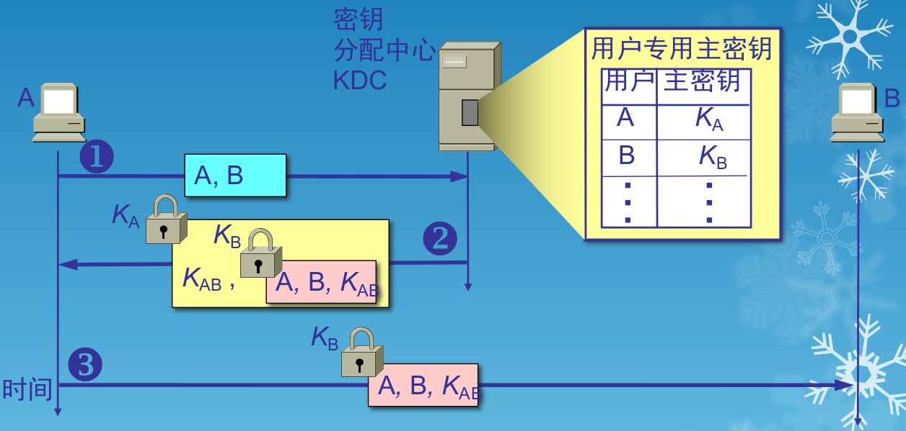

### 公钥的分配

- 需要有一个值得信赖的机构——即认证中心 CA(Certification Authority),来将公钥与其对应的实体(人或机器)进行绑定(binding)
- 认证中心一般由政府出资建立。每个实体都有 CA 发来的证书(certificate),里面有公钥及其拥有者的标识信息。此证书被 CA 进行了数字签名。任何用户都可从可信的地方获得认证中心 CA 的公钥,此公钥用来验证某个公钥是否为某个实体所拥有。有的大公司也提供认证中心服务

### 链路加密

- 在采用链路加密的网络中,每条通信链路上的加密是独立实现的。通常对每条链路使用不同的加密密钥
- 相邻结点之间具有相同的密钥，因而密钥管理易于实现。链路加密对用户来说是透明的，因为加密的功能是由通信子网提供的

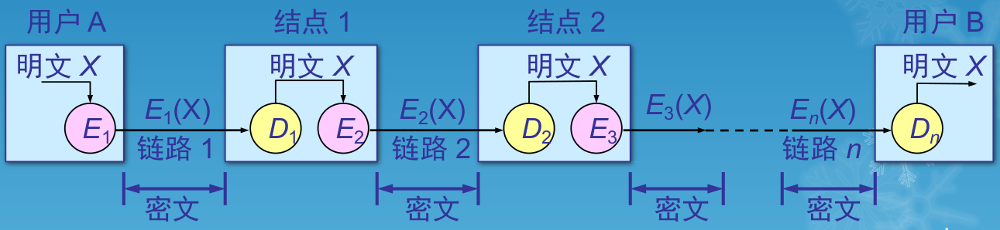

- 由于报文是以明文形式在各结点内加密的,所以结点本身必须是安全的
- 所有的中间结点(包括可能经过的路由器)未必都是安全的。因此必须采取有效措施
- 链路加密的最大缺点是在中间结点暴露了信息的内容
- 在网络互连的情况下,仅采用链路加密是不能实现通信安全的

### 端到端加密

- 端到端加密是在源结点和目的结点中对传送的 PDU 进行加密和解密,报文的安全性不会因中间结点的不可靠而受到影响

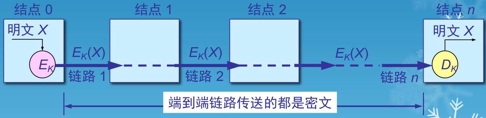

- 在端到端加密的情况下，PDU 的控制信息部分(如源结点地址、目的结点地址、路由信息等)不能被加密，否则中间结点就不能正确选择路由

---

## 防火墙(Firewall)

- 防火墙是由软件、硬件构成的系统,是一种特殊编程的路由器,用来在两个网络之间实施接入控制策略。接入控制策略是由使用防火墙的单位自行制订的,为的是可以最适合本单位的需要
- 防火墙内的网络称为“可信赖的网络”(trusted network),而将外部的因特网称为“不可信赖的网络”(untrusted network)
- 防火墙可用来解决内联网和外联网的安全问题

### 防火墙在互连网络中的位置

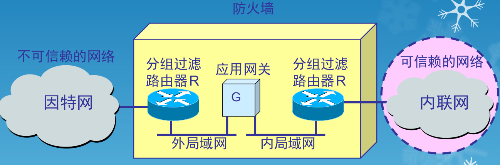

### 防火墙的功能

- 防火墙的功能有两个:阻止和允许
- “阻止”就是阻止某种类型的通信量通过防火墙(从外部网络到内部网络,或反过来)
- “允许”的功能与“阻止”恰好相反。
- 防火墙必须能够识别通信量的各种类型。不过在大多数情况下防火墙的主要功能是“阻止”

### 两类防火墙技术

- 网络级防火墙——用来防止整个网络出现外来非法的入侵。属于这类的有分组过滤和授权服务器。前者检查所有流入本网络的信息,然后拒绝不符合事先制订好的一套准则的数据,而后者则是检查用户的登录是否合法
- 应用级防火墙——从应用程序来进行接入控制。通常使用应用网关或代理服务器来区分各种应用。例如,可以只允许通过访问万维网的应用,而阻止 FTP 应用的通过

---

## 无线局域网

### 无线局域网的组成

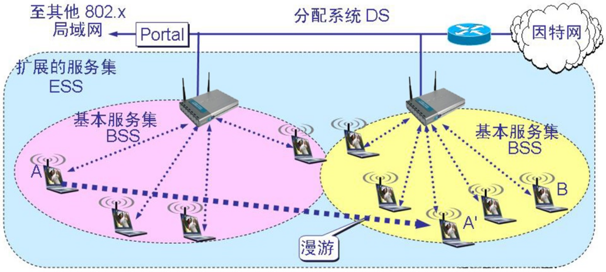

- 一个基本服务集 BSS 包括一个基站和若干个移动站,所有的站在本 BSS 以内都可以直接通信,但在和本 BSS 以外的站通信时,都要通过本 BSS 的基站

- 基本服务集内的基站叫做接入点 AP(Access Point)，其作用和网络类似。当网络管理员安装 AP 时，必须为该 AP 分配一个不超过32字节的服务及标识符 SSID 和一个信道

- 一个服务集可以是孤立的，也可以通过接入点 AP 连接到一个主干分配系统 DS(Distribution System)，然后再接入到另一个服务集，构成扩展的服务集 ESS(Extended Service Set)
- ESS 还可通过叫做门户(portal)为无线用户提供到非 802.11 无线局域网(例如,到有线连接的因特网)的接入。门户的作用就相当于一个网桥
- 移动站 A 从某一个基本服务集漫游到另一个基本服务集，仍可保持与另一个移动站 B 进行通信

### 与接入点 AP 建立关联

- 一个移动站若要加入到一个基本服务集 BSS,就必须先选择一个接入点 AP,并与此接入点建立关联
- 建立关联就表示这个移动站加入了选定的 AP 所属的子网,并和这个 AP 之间创建了一个虚拟线路
- 只有关联的 AP 才向这个移动站发送数据帧,而这个移动站也只有通过关联的 AP 才能向其他站点发送数据帧

### 移动站与 AP 建立关联的方法

- 被动扫描,即移动站等待接收接入站周期性发出的信标帧(beacon frame)
- 信标帧中包含有若干系统参数(如服务集标识符 SSID 以及支持的速率等)
- 主动扫描,即移动站主动发出探测请求帧(probe request frame),然后等待从 AP 发回的探测响应帧(probe response frame)

### 热点(hot spot)

- 现在许多地方,如办公室、机场、快餐店、旅馆、购物中心等都能够向公众提供有偿或无偿接入Wi-Fi 的服务。这样的地点就叫做热点
- 由许多热点和 AP 连接起来的区域叫做热区(hot zone)。热点也就是公众无线入网点
- 现在也出现了无线因特网服务提供者 WISP(Wireless Internet Service Provider)这一名词。用户可以通过无线信道接入到 WISP,然后再经过无线信道接入到因特网

### 自组网络(ad hoc network)

- 自组网络是没有固定基础设施(即没有 AP)的无线局域网。这种网络由一些处于平等状态的移动站之间相互通信组成的临时网络
- 在军事领域中,携带了移动站的战士可利用临时建立的移动自组网络进行通信
- 这种组网方式也能够应用到作战的地面车辆群和坦克群,以及海上的舰艇群、空中的机群
- 当出现自然灾害时,在抢险救灾时利用移动自组网络进行及时的通信往往很有效的

### 无线传感器网络 WSN

- 由大量传感器结点通过无线通信技术构成的自组网络
- 无线传感器网络的应用是进行各种数据的采集、处理和传输,一般并不需要很高的带宽,但是在大部分时间必须保持低功耗,以节省电池的消耗
- 由于无线传感结点的存储容量受限,因此对协议栈的大小有严格的限制
- 无线传感器网络还对网络安全性、结点自动配置、网络动态重组等方面有一定的要求

### 无线传感器网络主要的应用领域

- 环境监测与保护(如洪水预报、动物栖息的监控)
- 战争中对敌情的侦查和对兵力、装备、物资等的监控
- 医疗中对病房的监测和对患者的护理
- 在危险的工业环境(如矿井、核电站等)中的安全监测
- 城市交通管理、建筑内的温度/照明/安全控制等

### 移动自组网络和移动 IP

- 移动 IP 技术使漫游的主机可以用多种方式连接到因特网
- 移动 IP 的核心网络功能仍然是基于在固定互联网中一直在使用的各种路由选择协议
- 移动自组网络是将移动性扩展到无线领域中的自治系统,它具有自己特定的路由选择协议,并且可以不和因特网相连

### 几种不同的接入

- 固定接入(fixed access)——在作为网络用户期间,用户设置的地理位置保持不变
- 移动接入(mobility access)——用户设置能够以车辆速度移动时进行网络通信。当发生切换时,通信仍然是连续的
- 便携接入(portable access)——在受限的网络覆盖面积中,用户设备能够在以步行速度移动时进行网络通信,提供有限的切换能力
- 游牧接入(nomadic access)——用户设备的地理位置至少在进行网络通信时保持不变。如用户设备移动了位置,则再次进行通信时可能还要寻找最佳的基站

---

## 下一代的网际协议 IPv6 (IPng)

- 从计算机本身发展以及从因特网规模和网络传输速率来看,现在 IPv4 已很不适用
- 最主要的问题就是 32 位的 IP 地址不够用
- 要解决 IP 地址耗尽的问题的措施：
  - 采用无类别编址 CIDR，使 IP 地址的分配更加合理
  - 采用网络地址转换 NAT 方法以节省全球 IP 地址
  - 采用具有更大地址空间的新版本 IP 协议 IP6

### IPv6 的基本首部

- IPv6 仍支持无连接的传送所引进的主要变化如下：
  - 更大的地址空间。IPv6 将地址从 IPv4 的 32 位增大到了 128 位
  - 扩展的地址层次结构
  - 灵活的首部格式
  - 改进的选项
  - 允许协议继续扩充
  - 支持即插即用(即自动配置)
  - 支持资源的预分配

### IPv6 数据报的首部

- IPv6 将首部长度变为固定的 40 字节,称为基本首部(base header)
- 将不必要的功能取消了,首部的字段数减少到只有 8 个
- 取消了首部的检验和字段,加快了路由器处理数据报的速度
- 在基本首部的后面允许有零个或多个扩展首部
- 所有的扩展首部和数据合起来叫做数据报的有效载荷(payload)或净负荷

### IPv6 数据报的一般形式

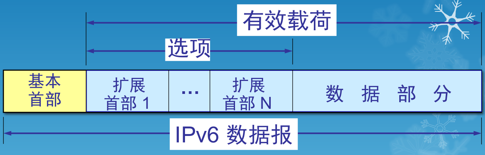

### IPv6 的扩展首部

- IPv6 把原来 IPv4 首部中选项的功能都放在扩展首部中,并将扩展首部留给路径两端的源站和目的站的主机来处理
- 数据报途中经过的路由器都不处理这些扩展首部(只有一个首部例外,即逐跳选项扩展首部)
- 这样就大大提高了路由器的处理效率

### IPv6 的地址空间

- IPv6 数据报的目的地址可以是以下三种基本类型地址之一：
  - 单播(unicast)是传统的点对点通信
  - 多播(multicast) 是一点对多点的通信
  - 任播(anycast) 是 IPv6 增加的一种类型。任播的目的站是一组计算机,但数据报在交付时只交付其中的一个,通常是距离最近的一个

### 结点与接口

- IPv6 将实现 IPv6 的主机和路由器均称为结点
- IPv6 地址是分配给结点上面的接口
  - 一个接口可以有多个单播地址
  - 一个接口结点的单播地址可用来唯一标志该结点

### 冒号十六进制记法

- colon hexadecimal notation
- 每个 16 位的值用十六进制值表示,各值之间用冒号分隔
- 68E6:8C64:FFFF:FFFF:0:1180:960A:FFFF
- 零压缩(zero compression),即一连串连续的零可以为一对冒号所取代
- FF05:0:0:0:0:0:0:B3 可以写成 FF05::B3

### 点分十进制记法的后缀

- 0:0:0:0:0:0:128.10.2.1 再使用零压缩即可得出: ::128.10.2.1
- CIDR 的斜线表示法仍然可用
- 60 位的前缀 12AB00000000CD3 可记为：12AB:0000:0000:CD30:0000:0000:0000:0000/60 或 12AB::CD30:0:0:0:0/60 或 12AB:0:0:CD30::/60

### 地址空间的分配

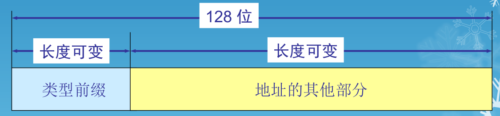

- IPv6 将 128 位地址空间分为两大部分
  - 第一部分是可变长度的类型前缀,它定义了地址的目的
  - 第二部分是地址的其余部分,其长度也是可变的

### 特殊地址

- 未指明地址是 16 字节的全 0 地址,可缩写为两个冒号“::”。这个地址只能为还没有配置到一个标准的 IP 地址的主机当作源地址使用
- 环回地址即 0:0:0:0:0:0:0:1(记为 ::1)
- 基于 IPv4 的地址：前缀为 0000 0000 保留一小部分地址作为与 IPv4 兼容的
  - 前缀为 0000 0000 是保留一小部分地址与 IPv4 兼容的,这是因为必须要考虑到在比较长的时期 IPv 4和 IPv6 将会同时存在,而有结点不支持IPv6
  - 因此数据报在这两类结点之间转发时,就必须进行地址的转换
- 本地链路单播地址

### 从 IPv4 向 IPv6 过渡

- 向 IPv6 过渡只能采用逐步演进的办法,同时,还必须使新安装的 IPv6 系统能够向后兼容
- IPv6 系统必须能够接收和转发 IPv4 分组,并且能够为 IPv4 分组选择路由
- 双协议栈(dual stack)是指在完全过渡到 IPv6 之前,使一部分主机(或路由器)装有两个协议栈,一个 IPv4 和一个 IPv6

### 用双协议栈进行从 IPv4 到 IPv6 的过渡

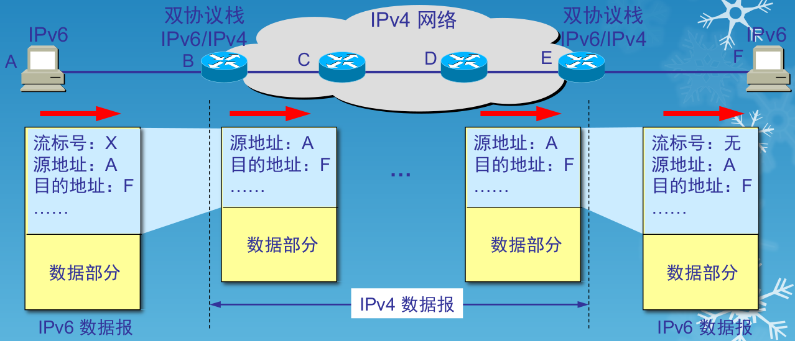

### 使用隧道技术从 IPv4 到 IPv6 过渡

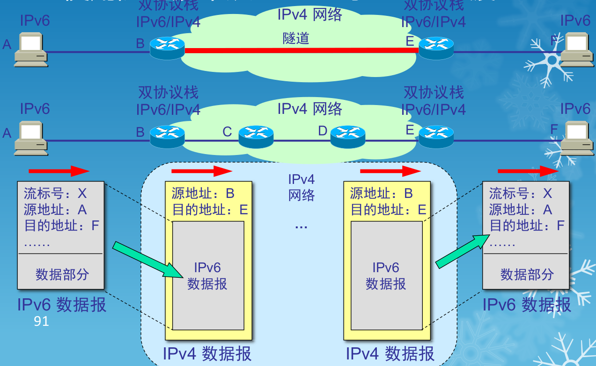

### ICMPv6

- ICMPv6 的报文格式和 IPv4 使用的 ICMP 的相似,即前 4 个字节的字段名称都是一样的
- 但 ICMPv6 将第 5 个字节起的后面部分作为报文主体
- ICMPv6 的报文划分为四大类：
  - 差错报告报文
  - 提供信息的报文
  - 多播听众发现报文
  - 邻站发现报文